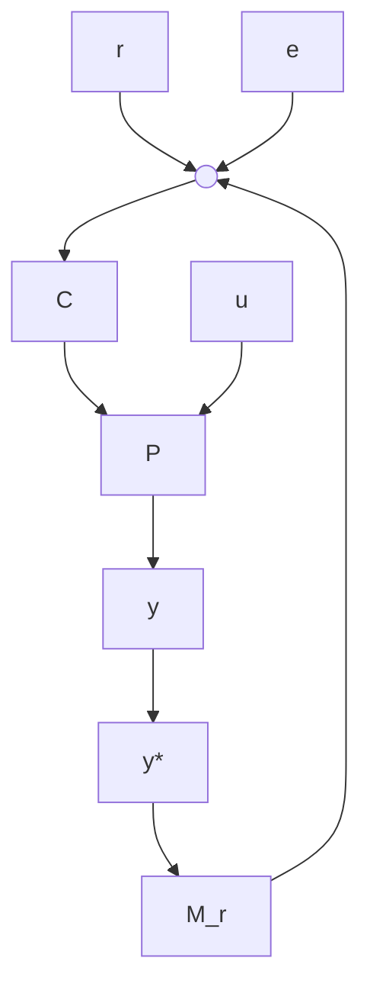

# II. DATA-DRIVEN DESIGN OF IFIR CONTROLLERS

iFIR controllers C combine integration and finite impulse response filtering. Given the finite coefficients $\{ g _ { k } \} _ { k = 0 , \ldots , m - 1 }$ , the controller is given by

$$C (z) = \underbrace {\frac {\gamma T _ {s}}{1 - z ^ {- 1}}} _ {\text { integrator }} + \underbrace {\sum_ {k = 0} ^ {m - 1} g _ {k} z ^ {- k}} _ {\text { FIR filter }} \tag {1}$$

where the integrator is discretized using backward Euler discretization with sampling period $T _ { s } , \gamma$ is the integral gain. In fact, C shows a generalized PID structure, where the proportional and derivative terms are replaced by a FIR filter.

C can be easily designed from data, following the approach of virtual reference feedback tuning [10]. In Figure 1, we represent the desired closed-loop performance with a timeinvariant (possibly nonlinear) reference model $M _ { r } , \ P$ is a time-invariant single-input single-output plant. The plant is not necessarily linear but we assume passivity from the input u to the output y (e.g. Euler-Lagrangian systems and port-Hamiltonian systems [1], [19]). For any given reference r, the ideal closed-loop behavior satisfies $y \simeq y ^ { * }$ .

flowchart

Fig. 1. Block diagram of the closed-loop system.

The controller can be derived as the solution of the following optimization problem:

$$\min _ {C \in \mathrm{iFIR}} \frac {1}{N} \sum_ {t = 0} ^ {N - 1} (u (t) - C \left(M _ {r} ^ {- 1} (y) - y\right) (t)) ^ {2} \tag {2}$$

where $\{ y ( t ) \} _ { t = 0 , \dots , N - 1 }$ is the measured open-loop plant output when the plant is excited with a user-defined signal $\{ u ( t ) \} _ { t = 0 , \dots , N - 1 }$ . The output signal y can be obtained by experiments, making the approach suitable for settings where a plant model is not fully available.
