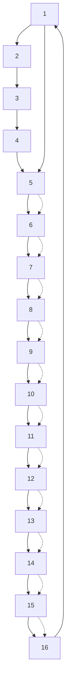

# A. Graph Theory

The connected graph $G = \{ V , A , E \}$ is used to describe the communication of a MAS with ???? agents $( N \in \mathbb { N } ^ { * } )$ ), where $V = \{ v _ { 1 } , v _ { 2 } , \ldots , v _ { N } \}$ is the node-set, $\mathbf { \bar { \rho } } _ { A } = \left[ a _ { i j } \right] \in \mathbb { R } ^ { \mathbf { \bar { \nu } } \times N }$ is the weighted adjacency matrix, and $E = \{ e _ { i j } = \left( v _ { i } , v _ { j } \right) : a _ { i j } \neq$ $0 , i \neq j , i , j \in \{ 1 , 2 , \dots , N \} \}$ is the edge set. The in-degree matrix is determined by $D = d i a g \{ { \bf d e g } _ { i n } ( v _ { i } ) , i =$ $1 , 2 , \ldots , N \}$ , where de $\mathfrak { s } _ { i n } ( v _ { i } ) ( 1 , 2 , \dots , N )$ denotes the indegree of the node $v _ { i } .$ , which is specified by $\deg _ { i n } ( v _ { i } ) =$ $\textstyle \sum _ { j = 1 } ^ { N } a _ { i j }$ ????. The Laplacian matrix is defined as $L = D - A$ .

$$L = \operatorname{diag} \left\{\sum_ {j = 1} ^ {N} a _ {1 j}, \dots , \sum_ {j = 1} ^ {N} a _ {n j} \right\} - A \tag {1}$$

It is called to have a directed path from the node $v _ { i }$ to node $v _ { j }$ , if there exists a finite number of nodes $( v _ { n _ { 1 } } , v _ { n _ { 2 } } , \ldots , v _ { n _ { l } } )$ $( l \le N , l \in \mathbb { N } , n _ { 1 } , n _ { 2 } , \dots , n _ { l } \in \{ 1 , 2 , \dots , N \} )$ ) satisfying that $\left\{ e _ { i , n _ { 1 } } , e _ { n _ { 1 } , n _ { 2 } } , \ldots , e _ { n _ { l } , j } \right\} \in E .$ A directed graph contains a spanning tree if a node $v _ { i } ( i \in \{ 1 , 2 , \dots , N \} )$ has directed paths to any node in the graph.

flowchart

Fig. 1: Directed interaction topology

Lemma 1. Let $\boldsymbol { L } \in \mathbb { R } ^ { N \times N }$ denote the Laplacian matrix of a directed graph ????. Then, one has:

1) If ???? is connected, then zero is a simple eigenvalue of $L ,$ , and all the other ???? − 1 eigenvalues are positive $a _ { i j } > 0$ .   
2) The matrix ???? is symmetric and positive semi-definite, that is, $L ^ { T } = L , L \geq 0$ .

$$
L = \left[ \begin{array}{c c c c} L _ {1 1} & 0 & \dots & 0 \\ L _ {1 2} & L _ {2 2} & \dots & 0 \\ \vdots & \vdots & \ddots & \vdots \\ L _ {n 1} & L _ {n 2} & \dots & L _ {n n} \end{array} \right] \tag {2}
$$

Lemma 2. Let $D \in \mathbb { R } ^ { N \times N }$ and $A \in \mathbb { R } ^ { N \times N }$ be the in-degree matrix and adjacency matrix of an undirected graph $G _ { \mathrm { { ; } } }$ , respectively. Then, one has:

1) The adjacency matrix A is symmetric;   
2) $\forall i \in N ^ { * } , ( D ^ { - 1 } A ) ^ { i } \geq 0 .$ , ???? $( D ^ { - 1 } A ) ^ { i + 1 } \geq 0 ;$   
3) The sequence of matrices $( D ^ { - 1 } A ) ^ { k }$ converges to a constant matrix as $k  \infty ,$ .
