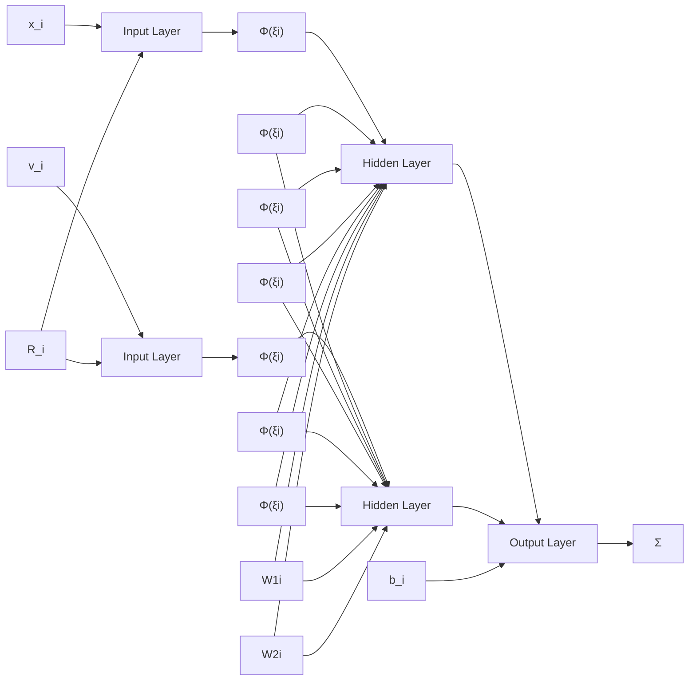

# 3 Main Results

In this section, a nonlinear protocol is taken into consideration, and competent NN structures are suggested for MAS to be effective in achieving group formation. The nonlinear term in the control protocol can be approximated by neural networks as shown in Fig.1.

flowchart

Fig.2: Structure of recurrent neural networks

In (11), the nonlinear function $f _ { i } ( x _ { i } , v _ { i } )$ is unknown but continuous, give a compact set $\Omega _ { i } \in \mathbb { R } ^ { 2 }$ , for $[ x _ { i } ^ { T } , v _ { i } ^ { T } ] ^ { T } \in$ $\Omega _ { i } .$ . it can be re-described by using its NN approximation as:

$$f _ {i} (x _ {i}, v _ {i}) = W _ {i} ^ {* T} \Phi_ {i} (x _ {i}, v _ {i}) + b _ {i} (x _ {i}, v _ {i}) \tag {14}$$

Where $W _ { i } ^ { * } \in \mathbb { R } ^ { q _ { i } \times N }$ is the ideal NN weight matrix with the NN neuron number $q _ { i } , \Phi _ { i } ( x _ { i } , v _ { i } ) \in \mathbb { R } ^ { q _ { i } }$ is the basis function vector, $b _ { i } ( x _ { i } , v _ { i } ) \in \mathbb { R } ^ { N }$ is the approximation error satisfied $\| b _ { i } ( x _ { i } , v _ { i } ) \| \leq \delta _ { i } .$ , where $\delta _ { i }$ is a constant.

In (9), consider the control protocol $u _ { i }$ for each agent $i ( i \in \{ 1 , 2 , \cdots , N \} )$ In (2), since the ideal weight matrix $W _ { i } ^ { * }$ is an unknown constant matrix, it is unavailable for the actual control design. By using the estimation $\widehat { W } _ { \iota } ( t )$ of the ideal NN weight $W _ { i } ^ { * }$ , the formation control is constructed in the following:

$$u _ {i} (t) = - \gamma_ {x} e _ {x i} (t) - \gamma_ {v} e _ {v i} (t) - \widehat {W} _ {\imath} ^ {T} (t) \times \Phi (x _ {i}, v _ {i}) \quad (1 5)i = 1, 2, \dots , N$$

where $\gamma _ { x } > 0 , \gamma _ { v } > 0$ are two design constants $\widehat { W _ { \iota } } ( t ) \in$ $\mathbb { R } ^ { m \times N }$ is the estimation of $W _ { i } ^ { * }$ .

The NN updating law for tuning $W _ { i } ^ { * }$ is given in the following:
