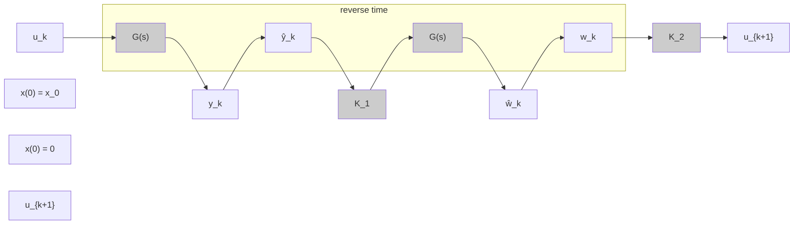

Fig. 1. Operator $u _ { k + 1 } = { \mathcal { T } } ( u _ { k } )$ defined in (17) whose fixed point coincides with the optimal solution of problem (13) by the Pontryagin’s principle (20). The constant gains are given by $K _ { 1 } = \Sigma _ { e } Q$ and $K _ { 2 } = \dot { - } R ^ { - 1 } \Sigma _ { e }$ and the dashed lines show the time-reversal operator (8).

which, after time reversal, takes the form

$$D ^ {\prime} Q C \hat {x} (\tau) + (R + D ^ {\prime} Q D) \hat {u} (\tau) + B ^ {\prime} \hat {\lambda} (\tau) = 0, \tag {25}$$

where $\tau = t _ { f } - t \in [ 0 , t _ { f } ]$ . By using Proposition 3 in (25), one has

$$
\begin{array}{l} 0 = \Sigma_ {e} D \Sigma_ {e} Q C \hat {x} (\tau) + (R + \Sigma_ {e} D \Sigma_ {e} Q D) \hat {u} (\tau) \\ + \Sigma_ {e} C T ^ {- 1} \hat {\lambda} (\tau) \\ = \Sigma_ {e} D \Sigma_ {e} Q (C \hat {x} (\tau) + D \hat {u} (\tau)) + \Sigma_ {e} C T ^ {- 1} \hat {\lambda} (\tau) + R \hat {u} (\tau) \\ = \Sigma_ {e} \hat {w} (\tau) + R \hat {u} (\tau), \tag {26} \\ \end{array}
$$

where ˆw is defined in (24). Solving equation (26) for ˆu and reversing the time τ back to t yields

$$u (t) = - R ^ {- 1} \Sigma_ {e} w (t). \tag {27}$$

Equation (27) expresses the optimal control input in terms of a system trajectory as observed from the outputs, without requiring the explicit system dynamics. The joint conditions (23), (24) and (27) are equivalent to the necessary and sufficient conditions of optimality (20) and can be described as the fixed-point equation

$$u = \mathcal {T} (u),$$

in which T is shown as a block diagram in Figure 1.

The following algorithm solves the problem (13) by finding the fixed point of (17). The optimal solution $u ^ { \star }$ is obtained within a numerical accuracy specified by $\epsilon _ { \mathrm { 0 } } .$ . The input parameters are $t _ { f } > 0 , Q \succeq 0 , R \succ 0$ , and the output is $u _ { k + 1 }$ . The only tunning parameter is the step size $\alpha \in ( 0 , 1 ]$ .

To study the convergence of Algorithm 1 we first require the following lemma.

Lemma 2. Let Assumption 1 hold. The linear operator $- R ^ { 1 / 2 } S R ^ { - 1 / 2 }$ is non-negative.
