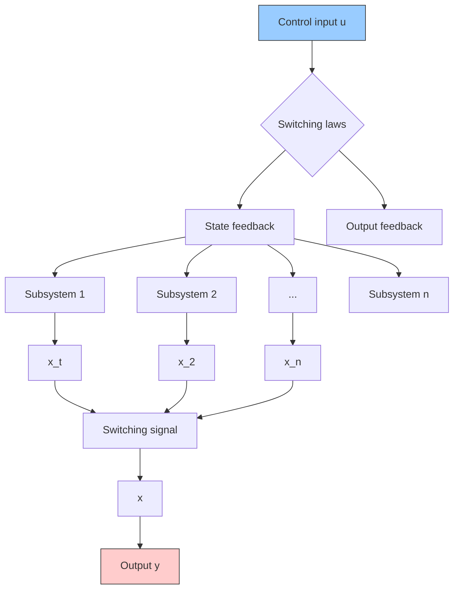

# A. Fundamental Concepts of Switched Systems

The rapid advancement of modern computer control technology has facilitated widespread applications of switching control techniques across various fields, including automatic control, automotive industries, power systems, and many others [35], [36]. As depicted in Fig. 1, a typical switched system contains a collection of continuous-time subsystems and associated switching laws orchestrating the switching among these subsystems. The dynamic evolution process of the switched system is determined by the dynamic of each subsystem and the corresponding switching laws.

flowchart

Fig. 1. Diagram of a typical switched system.

The generic mathematical model of switched systems can be expressed as

$$\dot {\boldsymbol {x}} = \boldsymbol {f} _ {\sigma} (\boldsymbol {x}), \sigma \in S \tag {1}$$

where $\textbf { \em x } \in ~ \mathbb { R } ^ { N }$ is the continuous system state vector with respect to time, $f _ { \sigma }$ is a set of regular functions representing the dynamic equations of subsystems, $S = \{ 1 , 2 , \cdots , n \}$ is an index set denoting the discrete states of the system with n subsystems, and $\bar { \sigma } : [ 0 , \infty )  S$ is a piecewise constant function of time taking values in S, which represents the switching signal. The value of σ(t) at a given time t depends on time or state vector values, or both, or more complex feedback effects [26].

If each individual subsystem is linear, the state space equation of the switched linear system can be expressed as

$$
\left\{ \begin{array}{l} \dot {\boldsymbol {x}} (t) = \boldsymbol {A} _ {\sigma} \boldsymbol {x} (t) + \boldsymbol {B} _ {\sigma} \boldsymbol {u} (t) \\ \boldsymbol {y} (t) = \boldsymbol {C} _ {\sigma} \boldsymbol {x} (t) + \boldsymbol {D} _ {\sigma} \boldsymbol {u} (t) \end{array} \right. \tag {2}
$$

where u is the control input vector, y is the output vector, and $A _ { \sigma } , B _ { \sigma } , C _ { \sigma } , D _ { \sigma }$ are constant matrices with appropriate dimensions when the value of σ maintains the same [24].
