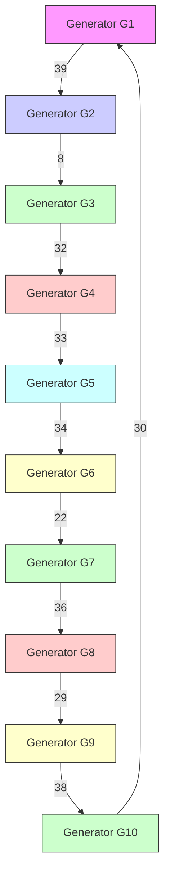

# VI. SIMULATION VERIFICATION

In this section, the effectiveness of the proposed WT-GSC switched system model, stability analysis approaches, sensitivity analysis methods, and parameter optimization algorithms are demonstrated through a case study on the electromagnetic transient simulation platform — CloudPSS [47], [48]. As shown in Fig. 5, the test system is a modified IEEE New England 39-bus system with a 1.5MW wind turbine connected to bus 32 through a 0.69/20kV transformer and an equivalent impedance. The connection impedance and control parameters of the wind turbine are the same as those in Table I, and the base frequency and simulation step are set to 50Hz and 50ms, respectively.

flowchart

Fig. 5. Topology of the modified IEEE 39-bus test system.

The SCR of the test system measuring at the wind turbine’s grid-connected point is approximately 1.84, indicating this is a weak system. As shown in Fig. 6, when the active power output of the wind turbine increases, the grid-connected point voltage decreases until becomes lower than the LVRT threshold (here we take vLVRT as 0.80p.u. [15]), thereby inducing repeated LVRT voltage oscillations according to the mechanism proposed in Section III.
