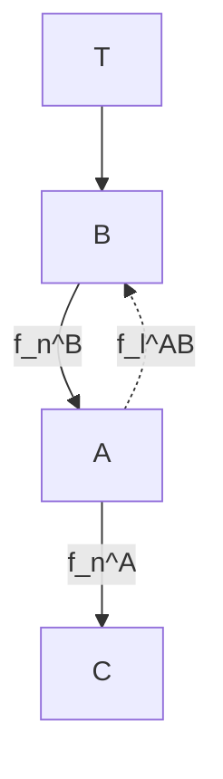

# B. Training configurations

We train our agents using episodes of 100 time steps, for a total of one million steps. For generalization, we initialize agent positions, target locations, and target motion patterns using different seeded random states across training and testing scenarios. During evaluation, each trained agent is tested in 100 new episodes, and we measure performance metrics with the safety filter consistently enabled.

We systematically evaluated different training configurations to assess the impact of our safety mechanism:

• Baseline: A vanilla MARL approach with no safety filter enabled. Edge features include only the base features f .

flowchart

Fig. 3: A typical configuration of our system. Agents are represented with letters A, B, C and targets with T. Agent A and B have established a successful connection. Agent A receives node features $f _ { n } ^ { A } , \ f _ { n } ^ { A }$ and edge features $f _ { n } ^ { A B }$ as inputs.

• Approach A (Safety Filter): Our main contribution. Agents use Algorithm 1 to prevent safety infringements.   
The binary safety activation indicator is incorporated into the agents’ edge-level features (f and $S _ { i , j } )$ .   
• Approach B (Safety + Penalty): We add an explicit penalty of −10 to Approach A whenever an agent attempts an action that would trigger the safety filter.   
• Approach C (Safety + Penalty + Early Truncation):

Building on Approach B, we truncate episodes immediately upon safety-triggering situations, thus enforcing even stricter safety adherence.

Every approach adopts the same learning algorithm and GNN architecture. In any configuration employing the safety filter, an agent violating (7) has its trajectory toward $x _ { s p }$ blocked at its current position.

Furthermore, we train an alternative of Approach A, called Approach A-Node, to investigate the benefits of our proposed integration of safety-informed edges IV-B. In this alternative approach, the agents utilize only the node-level features with the addition of a binary indicator S in case the agent had his safety filter activated during the previous step.
