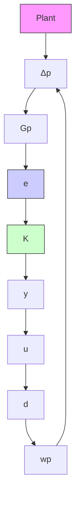

# 2 Problem Setup

We consider the problem of controlling an uncertain linear time-invariant (LTI) plant with a neural network controller to both satisfy a performance requirement and maximize a reward. This is a constrained optimization problem where the performance requirement is the constraint and the reward is the optimization objective. The interconnection of the plant and controller is depicted in Figure 1.

The uncertain LTI plant is modeled by the interconnection of an LTI system and an uncertainty $\Delta _ { p }$ . This is

flowchart

Fig. 1. Interconnection of plant, formed of LTI system $G _ { p }$ and uncertainty $\Delta _ { p } ,$ and controller K.

written as

$$
\begin{array}{l} \left[ \begin{array}{c} \dot {\boldsymbol {x}} _ {\boldsymbol {p}} (t) \\ \boldsymbol {v} _ {\boldsymbol {p}} (t) \\ \boldsymbol {e} (t) \\ \boldsymbol {y} (t) \end{array} \right] = \left[ \begin{array}{c c c c} A _ {p} & B _ {p w} & B _ {p d} & B _ {p u} \\ C _ {p v} & D _ {p v w} & D _ {p v d} & D _ {p v u} \\ C _ {p e} & D _ {p e w} & D _ {p e d} & D _ {p e u} \\ C _ {p y} & D _ {p y w} & D _ {p y d} & 0 \end{array} \right] \left[ \begin{array}{c} \boldsymbol {x} _ {\boldsymbol {p}} (t) \\ \boldsymbol {w} _ {\boldsymbol {p}} (t) \\ \boldsymbol {d} (t) \\ \boldsymbol {u} (t) \end{array} \right], \tag {1} \\ \pmb {w} _ {\pmb {p}} (t) = \Delta_ {p} (\pmb {v} _ {\pmb {p}}) (t), \\ \end{array}
$$
