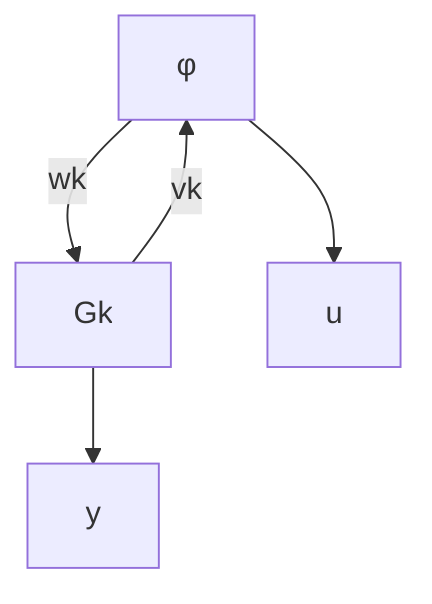

# 2.1 Neural Network Controller Model

The neural network controller is modeled as the interconnection of an LTI system and a nonlinearity $\phi$ (see

flowchart

Fig. 2. The neural network controller is modeled as the interconnection of an LTI system $G _ { k }$ and a nonlinearity ϕ. The nonlinearity represents the activation functions of the neural network.

Figure 2):

$$
\left[ \begin{array}{l} \dot {\boldsymbol {x}} _ {\boldsymbol {k}} (t) \\ \boldsymbol {v} _ {\boldsymbol {k}} (t) \\ \boldsymbol {u} (t) \end{array} \right] = \left[ \begin{array}{c c c} A _ {k} & B _ {k w} & B _ {k y} \\ C _ {k v} & D _ {k v w} & D _ {k v y} \\ C _ {k u} & D _ {k u w} & D _ {k u y} \end{array} \right] \left[ \begin{array}{l} \boldsymbol {x} _ {\boldsymbol {k}} (t) \\ \boldsymbol {w} _ {\boldsymbol {k}} (t) \\ \boldsymbol {y} (t) \end{array} \right], \tag {3}
\boldsymbol {w} _ {\boldsymbol {k}} (t) = \phi (\boldsymbol {v} _ {\boldsymbol {k}} (t)),$$

where $x _ { k } ~ \in ~ \mathbb { R } ^ { n _ { k } }$ is the controller state, $v _ { k } \in \mathbb { R } ^ { n _ { \phi } }$ is the input to the nonlinearity $\phi ,$ and $w _ { k } \in \mathbb { R } ^ { n _ { \phi } }$ is the output of the nonlinearity ϕ. Many neural networks can be modeled in this form, which mimics the form of the plant model. Our analysis in this paper benefits greatly from this unified representation.

The nonlinearity $\phi$ is memoryless and applied elementwise: $\phi$ is constructed from scalar nonlinearities $\phi _ { 1 } , . . . , \phi _ { n _ { \phi } }$ and $w _ { k , i } = \phi _ { i } ( v _ { k , i } )$ . Each scalar nonlinearity is sector-bounded in $[ 0 , 1 ] .$ , and slope-restricted in $[ 0 , 1 ]$ . The scalar nonlinearities are the activation functions of the neural network. Common activation functions that satisfy the sector bounds and slope restrictions are tanh and ReLU.
