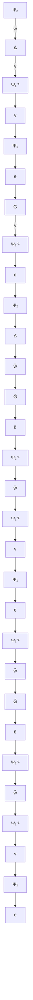

flowchart

```mermaid
graph TD
    A["Ψ₂"] -->|w| B["Δ"]
    B -->|v| C["Ψ₁⁻¹"]
    C --> D["v"]
    D --> E["Ψ₁"]
    E --> F["e"]
    F --> G["G"]
    G -->|v| H["Ψ₂⁻¹"]
    H --> I["d"]
    I --> J["Ψ₂"]
    J --> K["Δ̃"]
    K --> L["w̃"]
    L --> M["Ĝ"]
    M --> N["d̃"]
    N --> O["Ψ₂⁻¹"]
    O --> P["w̃"]
    P --> Q["Ψ₁⁻¹"]
    Q --> R["v"]
    R --> S["Ψ₁"]
    S --> T["e"]
    T --> U["Ψ₁⁻¹"]
    U --> V["w̃"]
    V --> W["Ĝ"]
    W --> X["d̃"]
    X --> Y["Ψ₂⁻¹"]
    Y --> Z["w̃"]
    Z --> AA["Ψ₁⁻¹"]
    AA --> AB["v"]
    AB --> AC["Ψ₁"]
    AC --> AD["e"]
```

Fig. 3. The original system, the interconnection of G and $\Delta ,$ is transformed such that the transformed uncertainty ∆˜ satisfies a simpler, static, IQC.
