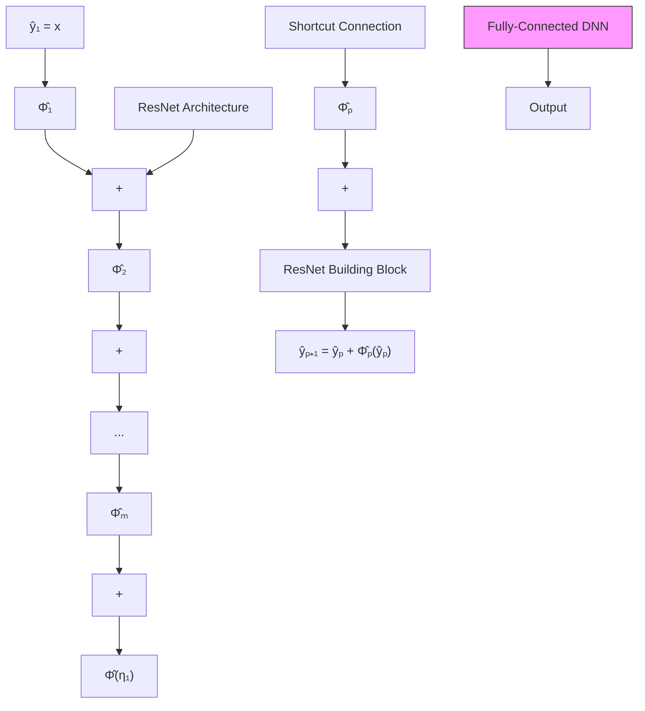

flowchart

Figure 1. Illustration of the ResNet architecture in (6). The ResNet is shown at the top of the figure and is composed of building blocks that involve a shortcut connection across a fully-connected DNN component. The fullyconnected DNN component for the $p ^ { t h }$ building block (bottom) is denoted by $\Phi _ { p } ^ { \theta _ { p } }$ Φp for all $p \in \{ 1 , \ldots , m \}$ , where the input and the vector of weights of $\Phi _ { p }$ are denoted by $\eta _ { p }$ and $\theta _ { p } ,$ respectively. Then the output of the $\mathbf { \widetilde { \mathbf { \Gamma } } } _ { p } ^ { t h }$ building block after considering the shortcut connection is represented by $\eta _ { p + 1 } \overset { \cdot } { = } \eta _ { p } + \Phi _ { p } ^ { \theta _ { p } } ( \eta _ { p } )$ for all $p \in \{ 1 , \ldots , m - 1 \}$ , and the output of the ResNet is $\eta _ { m } + \Phi _ { m } ^ { \theta _ { m } } \left( \eta _ { m } \right)$ .

Differentiating (1) on both sides with respect to vec (B) yields the property

$$\frac {\partial}{\partial \operatorname{vec} (B)} \operatorname{vec} (A B C) = (C ^ {T} \otimes A). \tag {2}$$
