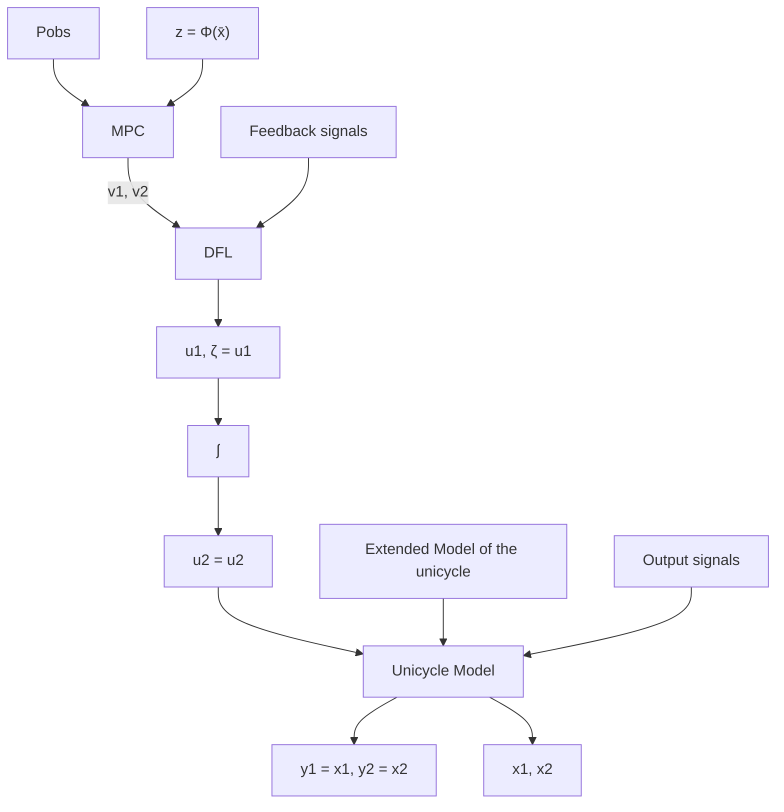

Fig. 2: SCMPCDFL control scheme for the unicycle ground robot.

subject to

$$z _ {k + 1} = A _ {e} z _ {k} + B _ {e} v _ {k}, \forall k = 0, \dots . N - 1 \tag {49}
\left[ \begin{array}{l} \underline {{z _ {1}}} \\ \underline {{z _ {3}}} \end{array} \right] \leq \left[ \begin{array}{l} z _ {1} \\ z _ {3} \end{array} \right] \leq \left[ \begin{array}{l} \bar {z} _ {1} \\ \bar {z} _ {3} \end{array} \right], \forall k = 0, \dots . N - 1 \tag {50}
v _ {\min} \leq v \leq v _ {\max}, \forall k = 0, \dots , N - 1. \tag {51}\triangle \mathcal {H} (z _ {d} (k + 1)) \geq - \gamma \mathcal {H} (z _ {d} (k)), k = 0, \dots , N - 1. \tag {52}v _ {\min} \leq K (A _ {d} + B _ {d} K) ^ {i} z _ {d} (k + N | k) \leq v _ {\max}, \forall k = 0, \dots , N _ {c}. \tag {53}
\left[ \begin{array}{l} \underline {{z}} _ {1} \\ \underline {{z}} _ {3} \end{array} \right] \leq (A _ {d} + B _ {d} K) ^ {i} z _ {d} (k + N | k) \leq \left[ \begin{array}{l} \overline {{z}} _ {1} \\ \overline {{z}} _ {3} \end{array} \right],
\forall k = 0, \dots , N _ {c}. \tag {54}$$

where $A _ { e }$ and $B _ { e }$ denote the discrete system matrices of (47), $\underline { { z } } _ { 1 }$ and $\underline { { z _ { 3 } } }$ are the minimum value of $z _ { 1 } ,$ , and $z _ { 3 } ,$ , respectively, and each of $\overline { { z } } _ { 1 }$ and $\overline { { z } } _ { 3 }$ refer to the maximum value. The prediction horizon is denoted by ?? and $N _ { c }$ is the constraint checking horizon. The proposed control barrier function is defined as follows:

$$\mathcal {H} (x _ {k}) = (z _ {1} - x _ {o b s}) ^ {2} + (z _ {3} - y _ {o b s}) ^ {2} - r _ {o b s} ^ {2} \tag {55}$$

such that $x _ { o b s }$ and $y _ { o b s }$ describe the ?? and ?? coordinates of the spherical obstacle, respectively and $r _ { o b s }$ is the radius of the obstacle. It is worth noting that all the constraints are linear except the Quadratic safety constraint defined in (52) which is quadratic. In view of (52), one can define the level set of CBF constraints as follows:

$$C _ {k} = \{x \in \mathbb {R} ^ {2}: \mathcal {H} (x _ {k}) = (1 - \gamma) \mathcal {H} (x _ {k + 1}) \} \tag {56}$$
