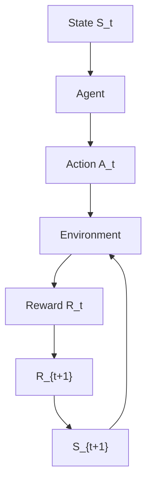

In the model-free RL paradigm, an agent generally has two choices while interacting with the environment:

• either choose actions that help the agent better understand the underlying relationship between the environment and its action, i.e., prioritize exploration. This can be at the expense of sacrificing reward maximization to a certain degree, hoping to find a path toward better rewards in the long run.

• $\mathrm { o r } ,$ choose actions that maximize the agent’s reward, given its current understanding of the system, i.e., prioritize exploitation. This can be at the expense of getting to local maxima, meaning it can get stuck with locally optimal actions, while potentially neglecting better actions not known to the agent owing to its poor exploration.

This is commonly called exploration-exploitation dilemma [20], which mandates some savvy ways of striking a balance between how much an agent explores compared to how much it exploits. This implies the possibility of taking sub-optimal or unsafe actions during exploration, leading to undesirable behavior. When deploying an agent into a robotic system safety concerns arise due to this dilemma. In a non-stationary environment, there is a need to learn continuously and thus explore. Hence the need of researching ways to guarantee safety.

flowchart

Figure 2. In reinforcement learning, an agent interacts with the environment. In a given state, the agent carries out an action and learns from the world by receiving a reward that is dependent on the previous state and the proposed action. The agent goes from one state to another with a state-transition probability that is unknown in real case scenarios.
