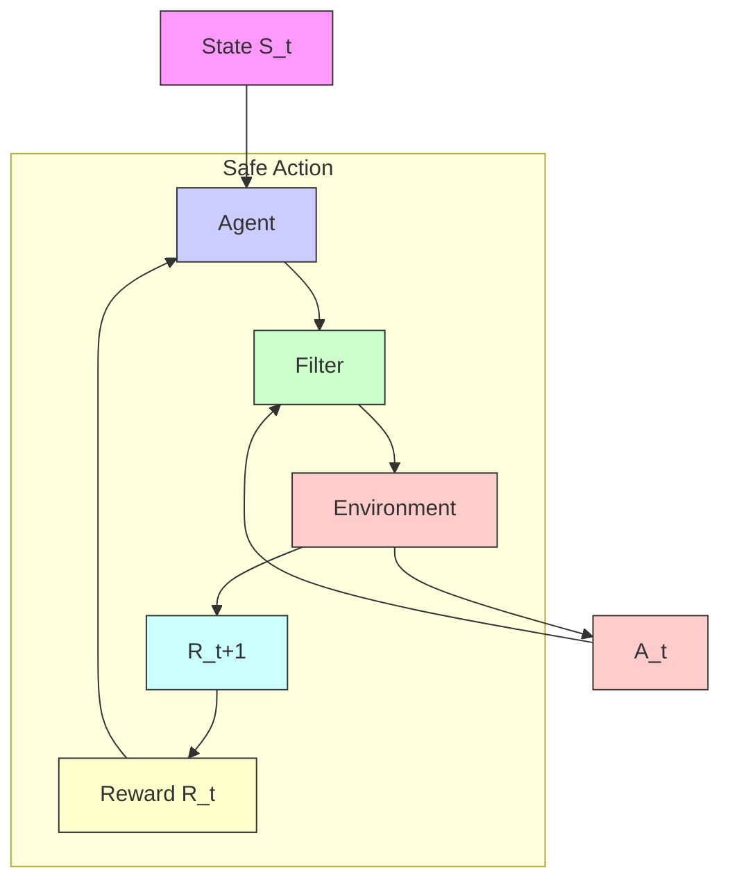

Figure 3. An illustrative example of how a filter function. The agent interact with the environment by proposing an action at a given state and shift to the next state given an unknown state-transition probability. The action is monitored by the filter while training and on deployment. The filter maps unsafe actions to safe ones to maintain system safety. If the filter has to change the action, the agent is aware of that fact and learns form its mistake, otherwise, it directly receives the reward from the environment.

The method in [64] adopts a similar framework as [4], but it decreases the complexity by learning a function as the shield directly, which predicts a binary outcome (safe/unsafe) based on observations. In order to reach the goal, a planner system combined with the shield proposes intermediary goals that are inherently safe.

Another example of using shields is presented in [78], where a shield is combined with the SARSA algorithm [69]. Upon choosing an action that is deemed unsafe by the shield, the action is removed from the action set and the exploration strategy is used to pick another action. In a similar fashion, the authors of [42] have embedded the shield concept within a policy, that overrides the current action upon constraint violation. The shield policy infers safety by checking the next state degree of recoverability.

2) USING CBF SAFETY FILTERS: Control Barrier Functions have gained a lot of attention in the past decade and have become very popular tools for enforcing safety constraints on dynamical systems [5]. Over the past few years we notice a consistent increase in the domains of applications of such tool, but in this paper we are interested in CBFs from an ML and RL perspective.
