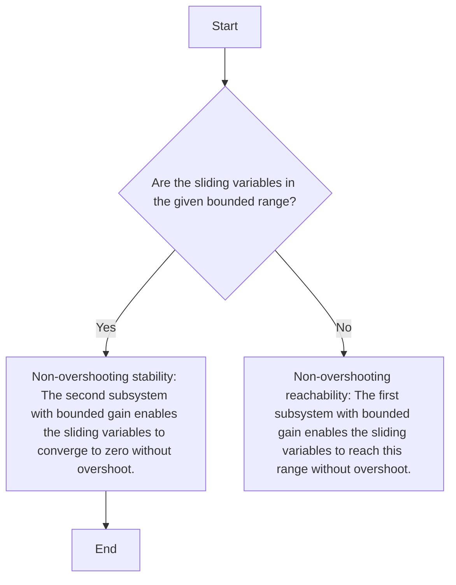

# 2.3 Performance metrics to evaluate the control methods

In the view of the problems under consideration, here, we give the performance metrics for evaluating the proposed control methods: 1) Global non-overshooting stability; 2) Robustness against the bounded stochastic disturbances; 3) Precision and maneuverability for reference trajectory tracking; 4) Non restriction on the system initial values.

flowchart

(a)

line

| Time (s) | e₁(t) | e₁(t_c) | e₂(t_c) | e₂(t)=-e₂c |
| --- | --- | --- | --- | --- |
| 0 | 0 | 0 | 0 | 0 |
| t_c | e₁(t_c) | 0 | e₂(t_c) | -e₂c |

Figure 1: Configuration of globally non-overshooting 2-sliding mode. (a) Flow chart of 2-sliding mode. (b) Convergence process of sliding variables.
