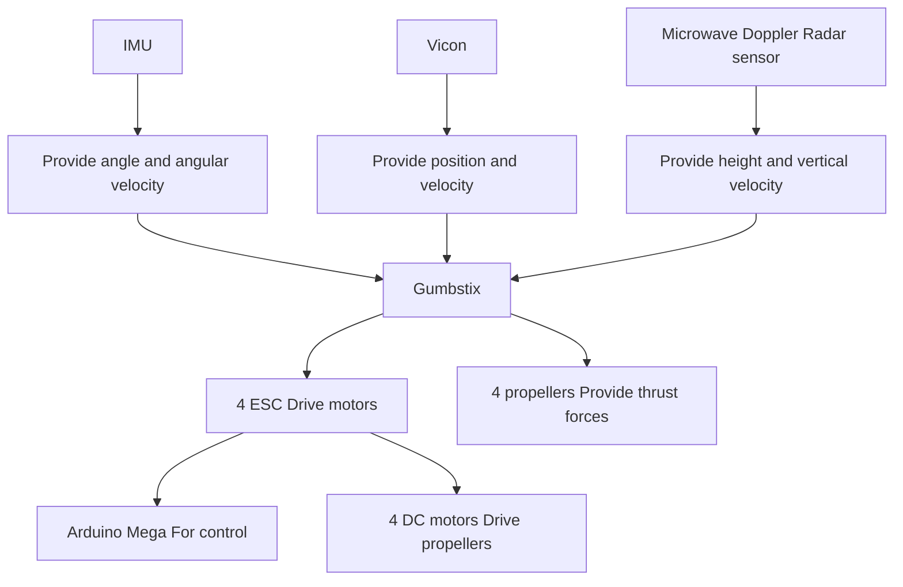

# 2) Controller design

From (24), we select the smoothed non-overshooting sliding mode as the desired stable, i.e.,

flowchart

Figure 8: Control system hardware.

$$\dot {e} _ {* 1} (t) = e _ {* 2} (t)
\dot {e} _ {* 2} (t) = \left\{ \begin{array}{l} - k _ {* c} \tanh \left[ \rho_ {* c} \left(e _ {* 2} (t) + e _ {* 2 c} \operatorname{sign} \left(e _ {* 1} (t)\right)\right) \right] + \ddot {*} _ {d} (t) - \delta_ {*} (t), \text {if} | e _ {* 1} (t) | > e _ {* 1 c}; \\ - k _ {* 2} \tanh \left[ \rho_ {*} \left(e _ {* 2} (t) + k _ {* 1} e _ {* 1} (t)\right) \right] + \ddot {*} _ {d} (t) - \delta_ {*} (t), \text {if} | e _ {* 1} (t) | \leq e _ {* 1 c} \end{array} \right. \tag {63}
$$

In order to turn the error system (62) into the desired stable sliding mode (63), we select

$$
\begin{array}{l} - h _ {*} (t) - \bar {u} _ {*} (t) + \ddot {*} _ {d} (t) - \delta_ {*} (t) \\ = \left\{ \begin{array}{l} - k _ {* c} \tanh \left[ \rho_ {* c} \left(e _ {* 2} (t) + e _ {* 2 c} \operatorname{sign} \left(e _ {* 1} (t)\right)\right) \right] + \ddot {*} _ {d} (t) - \delta_ {*} (t), \text {if} | e _ {* 1} (t) | > e _ {* 1 c}; \\ - k _ {* 2} \tanh \left[ \rho_ {*} \left(e _ {* 2} (t) + k _ {* 1} e _ {* 1} (t)\right) \right] + \ddot {*} _ {d} (t) - \delta_ {*} (t), \text {if} | e _ {* 1} (t) | \leq e _ {* 1 c} \end{array} \right. \tag {64} \\ \end{array}
$$

Therefore, we get the controller as follows:

$$
\bar {u} _ {*} (t) = \left\{ \begin{array}{l} k _ {* c} \tanh \left[ \rho_ {* c} \left(e _ {* 2} (t) + e _ {* 2 c} \operatorname{sign} \left(e _ {* 1} (t)\right)\right) \right] - h _ {*} (t), \text {   if   } | e _ {* 1} (t) | > e _ {* 1 c}; \\ k _ {* 2} \tanh \left[ \rho_ {*} \left(e _ {* 2} (t) + k _ {* 1} e _ {* 1} (t)\right) \right] - h _ {*} (t), \text {   if   } | e _ {* 1} (t) | \leq e _ {* 1 c} \end{array} \right. \tag {65}
$$

where, $\ast = x , y , z , \psi , \theta , \phi .$ . Thus, for the UAV system (59), when the controller (65) is selected, the system is stable, and the system variables $x _ { * 1 }$ (where, $\ast = x , y , z , \psi , \theta , \phi )$ are non-overshooting.
