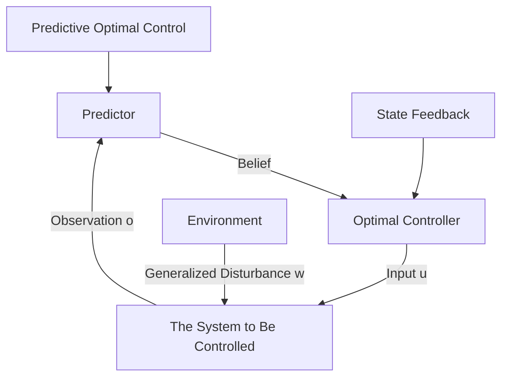

# 2.2. Components of Predictive Optimal Control

flowchart

Figure 2: A typical predictive optimal control structure. A predictor generates a belief of the future based on observations of the environment. The optimal controller decides the control input based on the belief.

To handle the future uncertainties of the disturbance sequence $\bar { w } .$ , it is common to use a predictor to forecast it. We consider the general case where the forecast result is a discrete or continuous probability distribution of ¯w. If one specific disturbance sequence is forecasted instead of a probability distribution, we may consider it as a distribution with a one or near-one probability at this specific sequence, and zero or near-zero probability at all other sequences. We call this probability distribution our belief.

Definition 1 (Belief). A belief is a subjective probability distribution of the future disturbance sequence ¯w.

We use $\bar { W } _ { b }$ to denote this probability distribution of ¯w. $\bar { W } _ { b } \in \bar { W }$ , where W¯ is the set of all possible probability distributions of ¯w. We write $\bar { w } \sim \bar { W } _ { b }$ , which means $\bar { w }$ follows the distribution $\bar { W } _ { b }$ . When there is no ambiguity, we do not distinguish the disturbance sequence probability distribution $\bar { W } _ { b }$ and its data representation, which may be a high-dimensional vector to represent a probability mass function, or a vector of parameters for a probability density function.

To obtain a belief $\hat { W } _ { b } .$ , we need to observe the environment for necessary information. We assume that $o \in \mathbb { O }$ is the observation from the environment. The observation $o$ may be in the form of sensor readings, images, videos, or data received via communication, and their histories. We can define the concept of predictors as follows.

Definition 2 (Predictor). A predictor $\mathcal { P } : \mathbb { O } \to \bar { W }$ is a mapping from an observation to a belief.
