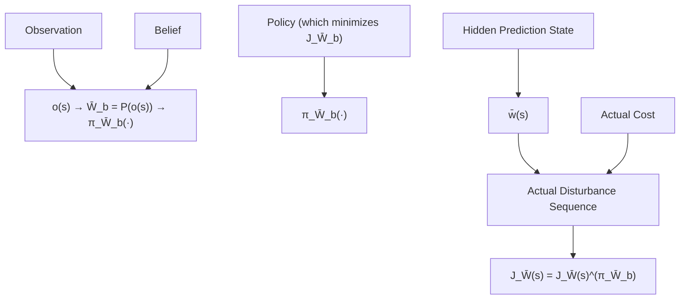
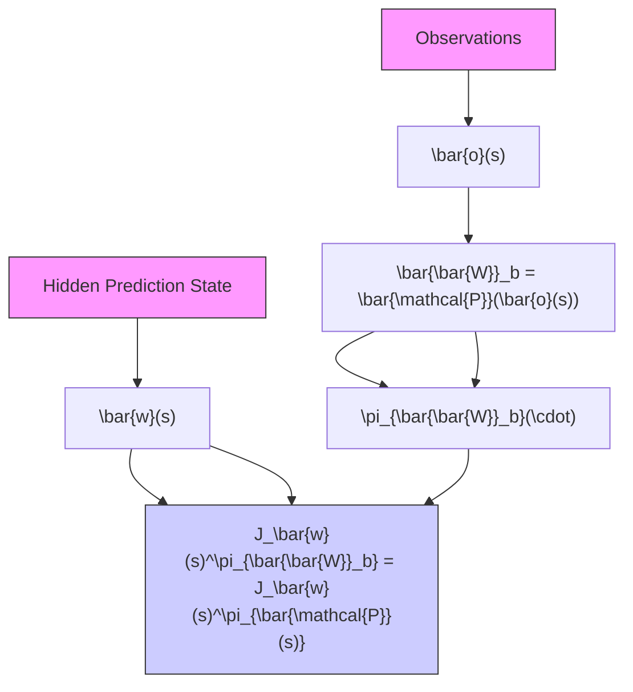
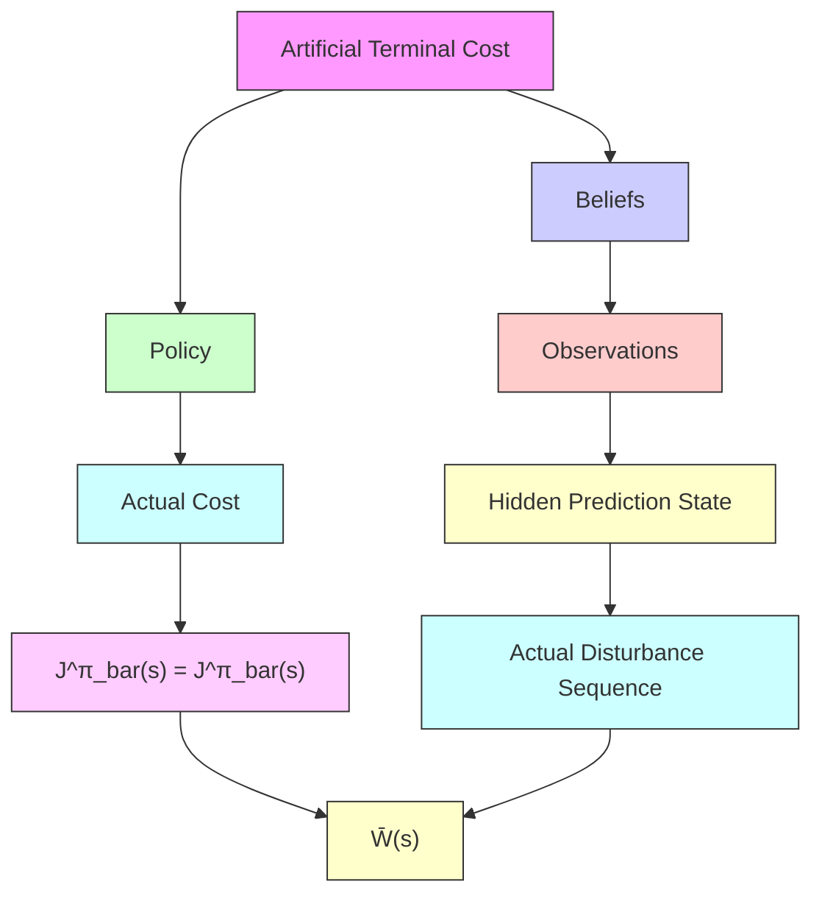

  
Figure 4: Three typical types of recurrent predictions. (a) Type I: the only observation is obtained at step 0. (b) Type II: a new observation is obtained at every step. (c). Type III: the prediction covers a fixed-length receding horizon with new observations at every step.

flowchart

(a) Type l

flowchart

(b) Type Il   

flowchart

