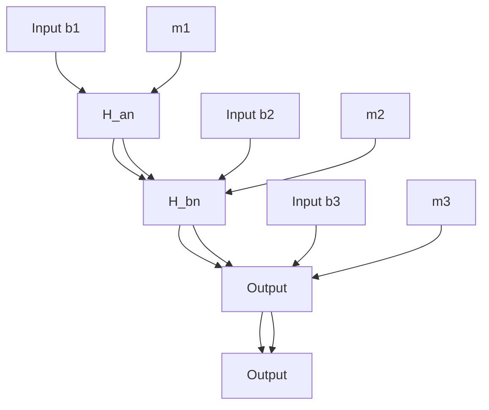

# 3 DNN-based Sliding Mode Control

The DNN model consists of four layers. The first layer is the input layer, composed of four input nodes denoted as $^ { \ 6 6 } I _ { n } ^ { \ 9 }$ . The second and third layers are hidden layers, with the number of nodes determined by specific practical needs. Here, they are set to three nodes each, denoted as $^ { \ast } H _ { a n } ^ { \quad \ast }$ and $^ { \ast } H _ { b n } \ '$ . The fourth layer is the output layer, containing one output node denoted as $^ { \mathfrak { s } } O _ { n } { } ^ { \mathfrak { s } }$ . The weight parameters between $^ { \ 6 } I _ { n } ^ { \ , , }$ and $^ { 6 6 } H _ { a n } ? $ , $^ { \ast } H _ { a n } ^ { \quad \ast }$ and $^ { \ast } H _ { b n } ^ { \phantom { \dagger } } \ '$ , and $^ { \ast } H _ { b n } ^ { \quad \ast }$ and $^ { \ast } O _ { n } { } ^ { \ast }$ are denoted by $m _ { 1 } , \ m _ { 2 }$ , and $m _ { 3 }$ , respectively. The connection weights are denoted as $W = [ m _ { 1 } + m _ { 2 } + m _ { 3 } ] ^ { T }$ , as shown in Fig. 3.

flowchart

Fig. 3 DNN model

The Root Mean Square Error (RMSE) is a commonly used metric to evaluate the performance of a model. It measures the difference between predicted and actual values, whereupon the optimal combination of hyperparameters can be selected based on the RMSE. Selecting the best combination of optimization functions and activation functions is crucial for obtaining the best performance. Table 1 provides a list of RMSE values for different combinations of these techniques and functions. Each epoch contains a weight update, and the table shows a comprehensive overview of the performance of each combination at 50 epochs. By selecting the combinations with the smallest RMSE values, the optimal deep learning model and hyperparameters can be determined.

Table 1 Hyperparameters selection
