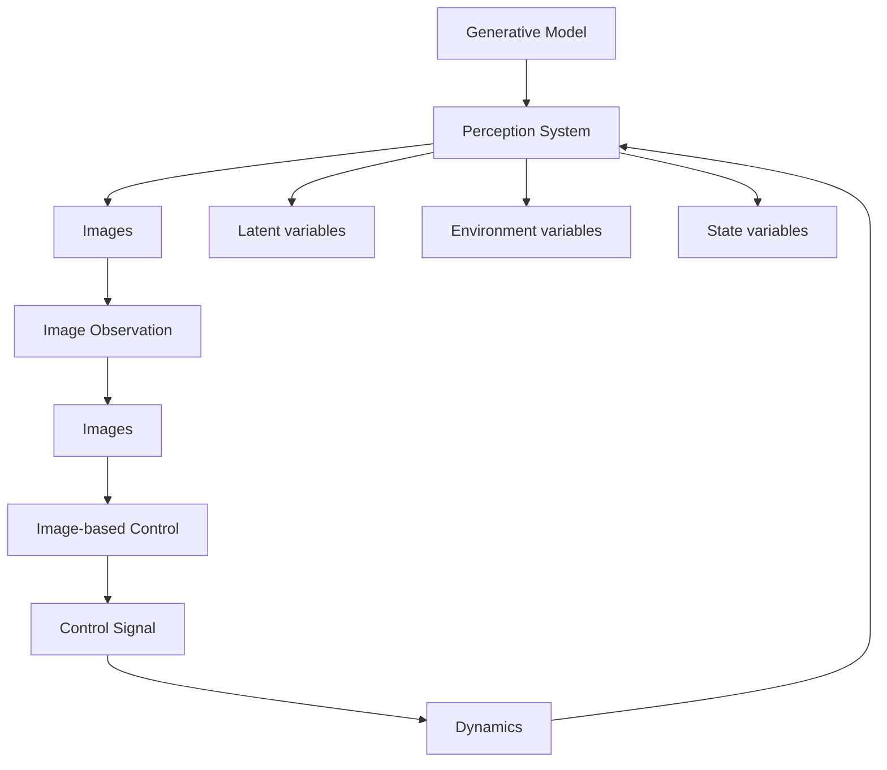

Infinite frequency introduces additional complexity for reachability analysis methods. We approach this issue by introducing another level of abstraction, approximating the neural network controller with a set of linear models that are valid in a local abstraction region. We provide safety guarantees by adding an additional uncertainty to each local model, ensuring the model is sound. Reachability analysis can then be used for a timestep by taking advantage of the discrete abstraction of the state space to evaluate closed-loop safety properties. We perform a case study on the Autonomous Aircraft Taxiing System (AATS) [20,8] and provide analysis on two closed-loop properties. The AATS can be seen in

flowchart

Fig. 1: Autonomous Aircraft Taxiing System closed-loop diagram. In this work, we verify the performance of the infinite frequency version of this system, whereas prior work assumed a fixed frequency (1Hz).

Figure 1 and we provide more details in the following sections. This is the first study, as far as the authors know, that considers continuously actuated neural network control systems for verification.

The main contributions of this work are as follows:

• We demonstrate the current limitations of state-of-art verification tools on systems with high frequency controllers.   
• We propose a method that generates local linear models combined with reachability analysis to analyze controllers with infinite frequency.   
• We apply our framework on a complex vision neural network controller and find a promising verifiable region. Throughout the analysis, we also find challenging verification queries for state-of-art open-loop neural network verification tools.
