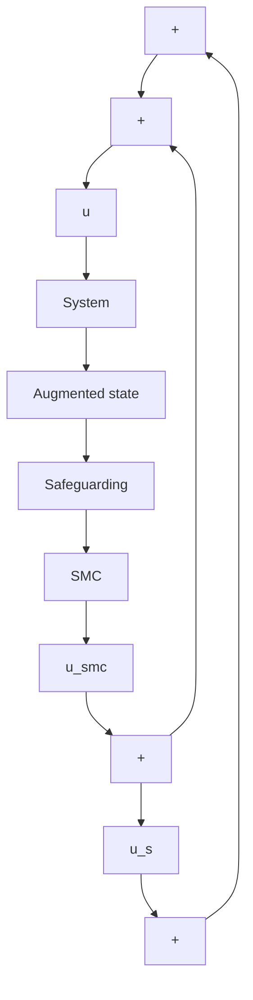

# I. INTRODUCTION

Sliding mode control (SMC), as a robust nonlinear control technique, offers several advantages that make it a popular choice in various control applications [1]. By driving the system state onto a sliding manifold, where the control action remains insensitive to uncertainties, SMC is robust to uncertainties and external disturbances. Thus, SMC can handle nonlinearities in the system dynamics without requiring an accurate mathematical model, making it applicable to complex nonlinear systems with uncertain or changing dynamics. These advantages have led to the widespread adoption of SMC in diverse fields, including robotics [2], [3] and aerospace [4], among others.

Ensuring safety in dynamical systems is a critical research area, receiving significant attention in the literature [5], [6]. Control barrier functions (CBFs) have gained prominence in both control and verification studies for their remarkable

flowchart

Fig. 1. Block diagram of the proposed safe sliding mode controller.

capability to enforce safety constraints [7], [8]. An important advantage of CBFs is their ability to integrate with control Lyapunov functions (CLFs), enabling the design of control strategies that simultaneously guarantee stability and safety [9], [10]. Typically, the integration of CBFs with CLFs is accomplished by solving constrained quadratic programs (QPs) in real-time [8]. CBFs have been successfully applied in various domains, including automotive systems [8], aerial systems [11], multi-robot systems [12], and energy systems [13], among others. Uncertainties and external disturbances are common factors in these systems, and CLFs-CBFs have proven effective in addressing these challenges. Their broad applicability and robustness make CBFs a valuable tool in real-world scenarios. Nevertheless, the impact of uncertainties and disturbances on safety control design is still an emerging and relatively underdeveloped area, presenting opportunities for further research and advancements.
