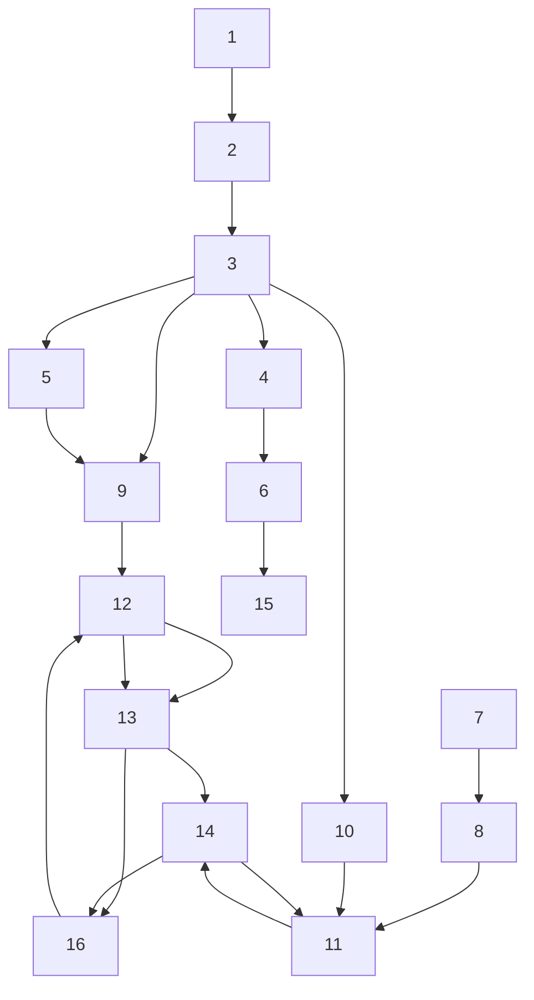

Pathways Through the Book The book was written with the objective of presenting comprehensive coverage of the field of adaptive control and of making the subject accessible to a large audience with different backgrounds and interests. Thus the book can be read and used in different ways.

For those only interested in applications we recommend the following sequence: Chaps.: 1, 2, 3 (Sects. 3.1 and 3.2), 5 (Sects. 5.1, 5.2, 5.7 through 5.9), 7 (Sects. 7.1, 7.2, 7.3.1 and 7.3.2), 8 (Sects. 8.1, 8.2 and 8.3.1), 9 (Sects. 9.1 and 9.6), 10 (Sect. 10.1), 11 (Sects. 11.1 and 11.2), 12 (Sects. 12.1 and 12.2.1), 13 (Sects. 13.1, 13.2 and 13.4), 14 (Sects. 14.1, 14.2, 14.4 and 14.7), 15 (Sects. 15.1, 15.2 and 15.5) and Chap.16. Most of the content of Chaps. 14 and 15 can also be read just after Chap. 3. The sequence above (till Chap. 15) can also serve as an introductory course in adaptive control.

Fig. 1 Logical dependence of the chapters   

flowchart

For a more in-depth study of the field a course should include in addition the following Sects.: 3.3, 3.4, 4.1, 4.2, 5.3 through 5.6, 6.1, 6.2, 7.3.3 through 7.7, 8.3 through 8.6, 9.2 through 9.6, 10.2, 10.3, 10.4, 10.6, 11.4.1, 11.4.2 and 11.6, 12.2.2 through 12.3.1, 12.4 and 12.7, 13.3, 14.3, 14.5, 15.3 and 15.4. A graduate course in adaptive control might include all chapters of the book.

The material has been organized so that readers can easily see how the more technical parts of the book can be bypassed. Figure 1 shows the logical progression of the chapters.

The Website Complementary information and material for teaching and applications can be found on the book website: http://www.landau-adaptivecontrol.org.

http://http://www.gipsa-lab.grenoble-inp.fr/\~ioandore.landau/adaptivecontrol/

Acknowledgments We wish to acknowledge the large number of contributors on whose work our presentation is partly based. In particular, we wish to mention: G. Zames, V.M. Popov, L. Ljung, G. Goodwin, D. Clarke, K.J. Aström, B.D.O. Anderson, A.S. Morse, P. Kokotovic from whom we learned many things.
