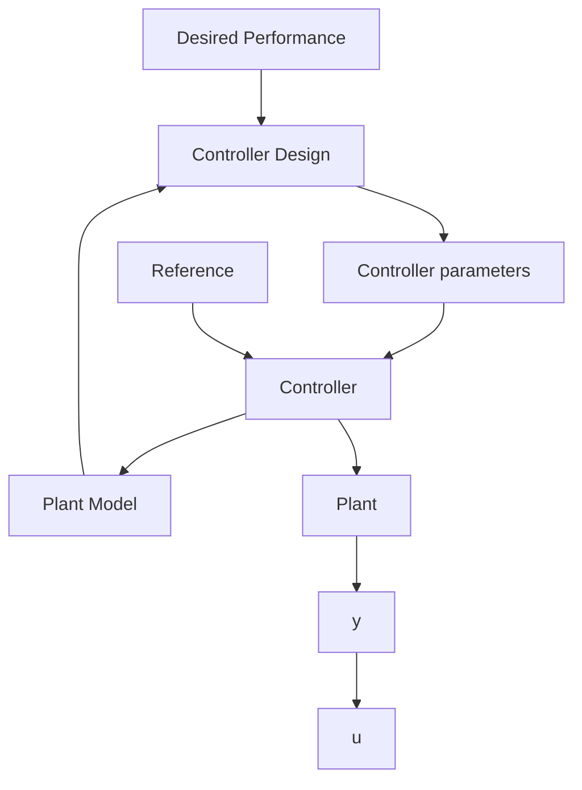
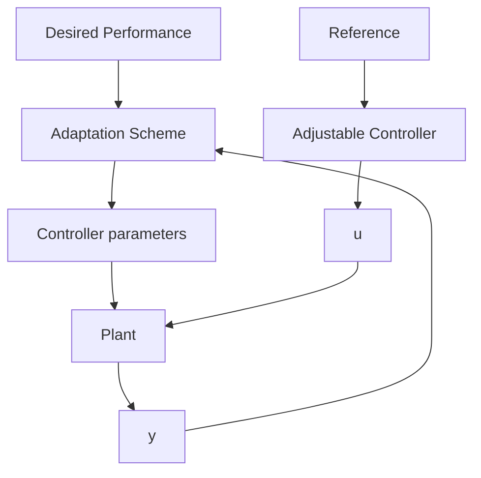

flowchart

Fig. 1.2 An adaptive control system   

flowchart

(1) Specify the desired control loop performances.   
(2) Know the dynamic model of the plant to be controlled.   
(3) Possess a suitable controller design method making it possible to achieve the desired performance for the corresponding plant model.

The dynamic model of the plant can be identified from input/output plant measurements obtained under an experimental protocol in open or in closed loop. One can say that the design and tuning of the controller is done from data collected on the system. An adaptive control system can be viewed as an implementation of the above design and tuning procedure in real time. The tuning of the controller will be done in real time from data collected in real time on the system. The corresponding adaptive control scheme is shown in Fig. 1.2.

The way in which information is processed in real time in order to tune the controller for achieving the desired performances will characterize the various adaptation techniques. From Fig. 1.2, one clearly sees that an adaptive control system is nonlinear since the parameters of the controller will depend upon measurements of system variables through the adaptation loop.
