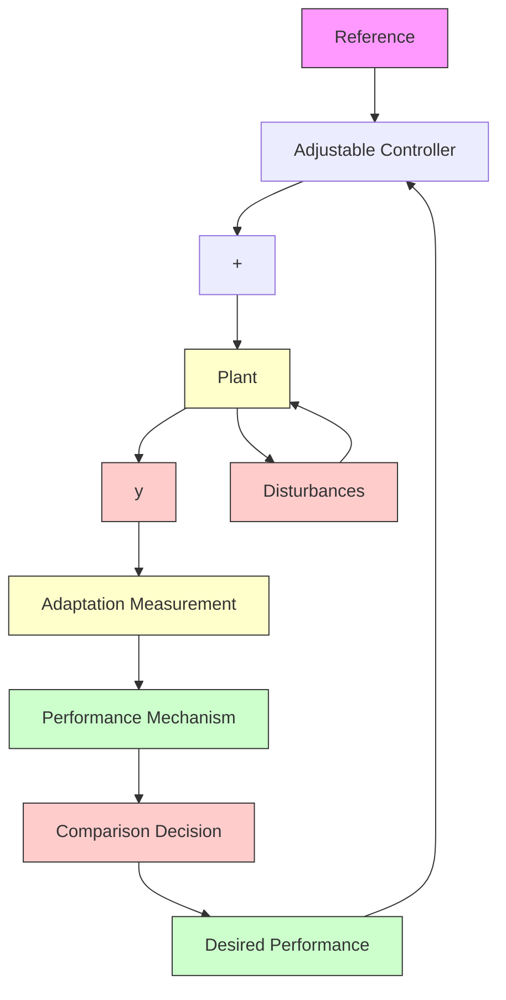

Definition 1.1 An adaptive control system measures a certain performance index (IP) of the control system using the inputs, the states, the outputs and the known disturbances. From the comparison of the measured performance index and a set of given ones, the adaptation mechanism modifies the parameters of the adjustable controller and/or generates an auxiliary control in order to maintain the performance index of the control system close to the set of given ones (i.e., within the set of acceptable ones).

Note that the control system under consideration is an adjustable dynamic system in the sense that its performance can be adjusted by modifying the parameters of the controller or the control signal. The above definition can be extended straightforwardly for “adaptive systems” in general (Landau 1979).

A conventional feedback control system will monitor the controlled variables under the effect of disturbances acting on them, but its performance will vary (it is not monitored) under the effect of parameter disturbances (the design is done assuming known and constant process parameters).

flowchart

Fig. 1.3 Basic configuration for an adaptive control system

An adaptive control system, which contains in addition to a feedback control with adjustable parameters a supplementary loop acting upon the adjustable parameters of the controller, will monitor the performance of the system in the presence of parameter disturbances.
