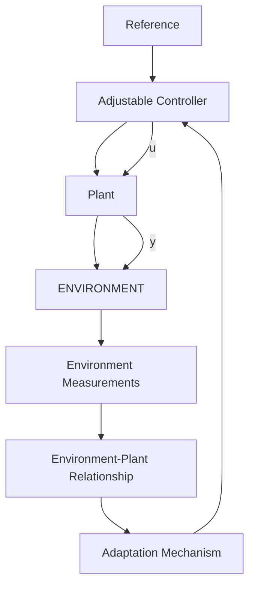

# 1.3 Basic Adaptive Control Schemes

In the context of various adaptive control schemes, the implementation of the three fundamental blocks of Fig. 1.3 (performance measurement, comparison-decision, adaptation mechanism) may be very intricate. Indeed, it may not be easy to decompose the adaptive control scheme in accordance with the basic diagram of Fig. 1.3. Despite this, the basic characteristic which allows to decide whether or not a system is truly “adaptive” is the presence or the absence of the closed-loop control of a certain performance index. More specifically, an adaptive control system will use information collected in real time to improve the tuning of the controller in order to achieve or to maintain a level of desired performance. There are many control systems which are designed to achieve acceptable performance in the presence of parameter variations, but they do not assure a closed-loop control of the performance and, as such, they are not “adaptive”. The typical example is the robust control design which, in many cases, can achieve acceptable performances in the presence of parameter variations using a fixed controller.

flowchart

Fig. 1.8 Open-loop adaptive control

We will now go on to present some basic schemes used in adaptive control.
