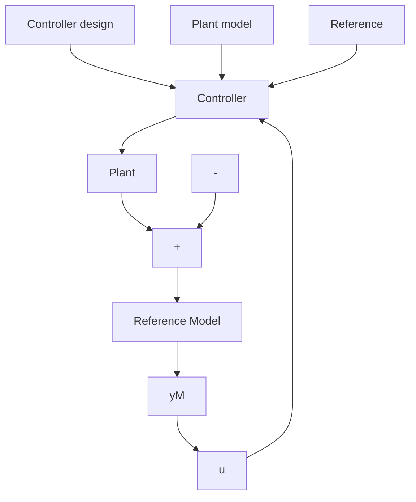

# 1.3.2 Direct Adaptive Control

Consider the basic philosophy for designing a controller discussed in Sect. 1.1 and which was illustrated in Fig. 1.1.

One of the key points is the specification of the desired control loop performance. In many cases, the desired performance of the feedback control system can be specified in terms of the characteristics of a dynamic system which is a realization of the desired behavior of the closed-loop system. For example, a tracking objective specified in terms of rise time, and overshoot, for a step change command can be alternatively expressed as the input-output behavior of a transfer function (for example a second-order with a certain resonance frequency and a certain damping). A regulation objective in a deterministic environment can be specified in terms of the evolution of the output starting from an initial disturbed value by specifying the desired location of the closed-loop poles. In these cases, the controller is designed such that for a given plant model, the closed-loop system has the characteristics of the desired dynamic system.

The design problem can in fact be equivalently reformulated as in Fig. 1.9. The reference model in Fig. 1.9 is a realization of the system with desired performances. The design of the controller is done now in order that:

(1) the error between the output of the plant and the output of the reference model is identically zero for identical initial conditions;   
(2) an initial error will vanish with a certain dynamic.

When the plant parameters are unknown or change in time, in order to achieve and to maintain the desired performance, an adaptive control approach has to be considered and such a scheme known as Model Reference Adaptive Control (MRAC) is shown in Fig. 1.10.

Fig. 1.9 Design of a linear controller in deterministic environment using an explicit reference model for performance specifications   

flowchart

Fig. 1.10 Model Reference Adaptive Control scheme   

