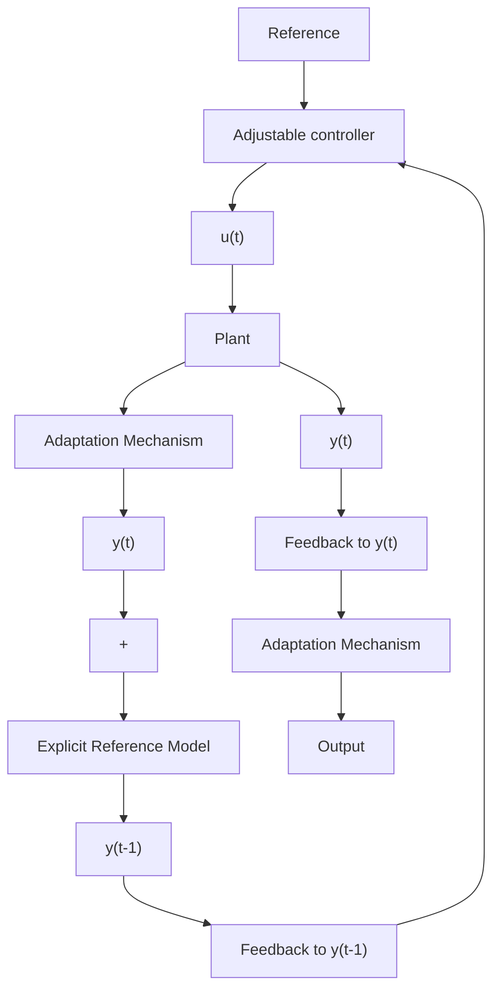

flowchart

This scheme is based on the observation that the difference between the output of the plant and the output of the reference model (called subsequently plant-model error) is a measure of the difference between the real and the desired performance. This information (together with other information) is used by the adaptation mechanism (subsequently called parameter adaptation algorithm) to directly adjust the parameters of the controller in real time in order to force asymptotically the plantmodel error to zero. This scheme corresponds to the use of a more general concept called Model Reference Adaptive Systems (MRAS) for the purpose of control. See Landau (1979). Note that in some cases, the reference model may receive measurements from the plant in order to predict future desired values of the plant output.

The model reference adaptive control scheme was originally proposed by Whitaker et al. (1958) and constitutes the basic prototype for direct adaptive control.
