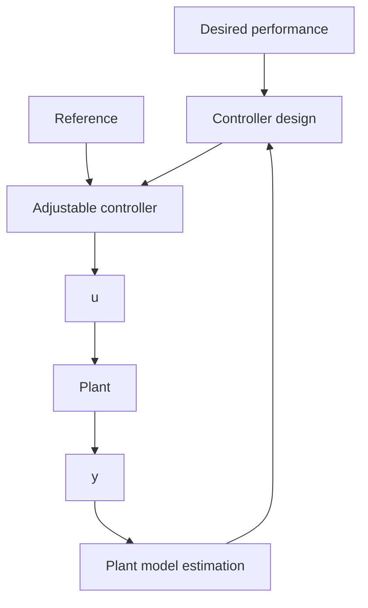

The concept of model reference control, and subsequently the concept of direct adaptive control, can be extended for the case of operation in a stochastic environment. In this case, the disturbance affecting the plant output can be modeled as an ARMA process, and no matter what kind of linear controller with fixed parameter will be used, the output of the plant operating in closed loop will be an ARMA model. Therefore the control objective can be specified in terms of a desired ARMA model for the plant output with desired properties. This will lead to the concept of stochastic reference model which is in fact a prediction reference model. See Landau (1981). The prediction reference model will specify the desired behavior of the predicted output. The plant-model error in this case is the prediction error which is used to directly adapt the parameters of the controller in order to force asymptotically the plant-model stochastic error to become an innovation process. The self tuning minimum variance controller (Åström and Wittenmark 1973) is the basic example of direct adaptive control in a stochastic environment. More details can be found in Chaps. 7 and 11.

Fig. 1.11 Indirect adaptive control (principle)   

flowchart

Despite its elegance, the use of direct adaptive control schemes is limited by the hypotheses related to the underlying linear design in the case of known parameters. While the performance can in many cases be specified in terms of a reference model, the conditions for the existence of a feasible controller allowing for the closed loop to match the reference model are restrictive. One of the basic limitations is that one has to assume that the plant model has in all the situations stable zeros, which in the discrete-time case is quite restrictive.1 The problem becomes even more difficult in the multi-input multi-output case. While different solutions have been proposed to overcome some of the limitations of this approach (see for example M’Saad et al. 1985; Landau 1993a), direct adaptive control cannot always be used.
