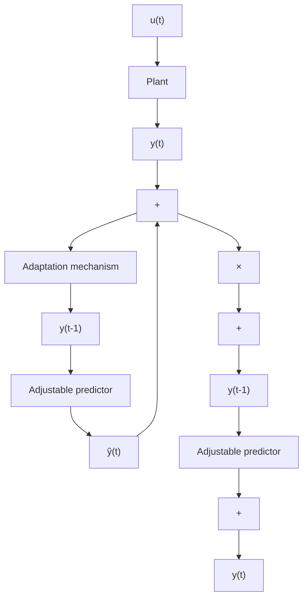

# 1.3.3 Indirect Adaptive Control

Figure 1.11 shows an indirect adaptive control scheme which can be viewed as a real-time extension of the controller design procedure represented in Fig. 1.1. The basic idea is that a suitable controller can be designed on line if a model of the plant is estimated on line from the available input-output measurements. The scheme is termed indirect because the adaptation of the controller parameters is done in two stages:

(1) on-line estimation of the plant parameters;   
(2) on-line computation of the controller parameters based on the current estimated plant model.

Fig. 1.12 Basic scheme for on-line parameter estimation   

flowchart

This scheme uses current plant model parameter estimates as if they are equal to the true ones in order to compute the controller parameters. This is called the ad-hoc certainty equivalence principle.2

The indirect adaptive control scheme offers a large variety of combinations of control laws and parameter estimation techniques. To better understand how these indirect adaptive control schemes work, it is useful to consider in more detail the on-line estimation of the plant model.

The basic scheme for the on-line estimation of plant model parameters is shown in Fig. 1.12. The basic idea is to build an adjustable predictor for the plant output which may or may not use previous plant output measurements and to compare the predicted output with the measured output. The error between the plant output and the predicted output (subsequently called prediction error or plant-model error) is used by a parameter adaptation algorithm which at each sampling instant will adjust the parameters of the adjustable predictor in order to minimize the prediction error in the sense of a certain criterion. This type of scheme is primarily an adaptive predictor which will allow an estimated model to be obtained asymptotically giving thereby a correct input-output description of the plant for the given sequence of inputs.
