```mermaid
graph TD
    A["Reference"] --> B["Adjustable controller"]
    B --> C["u"]
    C --> D["Plant"]
    D --> E["y"]
    E --> F["Adaptation mechanism 1"]
    F --> G["Adaptive predictor"]
    G --> H["Adaptation mechanism 2 (design)"]
    H --> I["u"]
    I --> J["Plant"]
    J --> K["y"]
    K --> L["Adaptation mechanism 1"]
    L --> M["Adaptive predictor"]
    M --> N["Parameter estimates"]
    N --> O["Adaptive predictor"]
    O --> P["Adaptation mechanism 2 (design)"]
    P --> Q["u"]
    Q --> R["Plant"]
    R --> S["y"]
    S --> T["Adaptation mechanism 1"]
    T --> U["Adaptive predictor"]
    U --> V["Parameter estimates"]
    V --> W["Adaptive predictor"]
    W --> X["u"]
    X --> Y["Plant"]
    Y --> Z["y"]
    Z --> AA["Adaptation mechanism 2 (design)"]
    AA --> AB["u"]
    AB --> AC["Plant"]
    AC --> AD["y"]
    AD --> AE["Adaptation mechanism 1"]
    AE --> AF["Adaptive predictor"]
    AF --> AG["u"]
    AG --> AH["Plant"]
    AH --> AI["y"]
    AI --> AJ["Adaptation mechanism 2 (design)"]
    AJ --> AK["u"]
    AK --> AL["Plant"]
    AL --> AM["y"]
    AM --> AN["Adaptation mechanism 1"]
    AN --> AO["Adaptive predictor"]
    AO --> AP["u"]
    AP --> AQ["Plant"]
    AQ --> AR["y"]
    AR --> AS["Adaptation mechanism 2 (design)"]
    AS --> AT["u"]
    AT --> AU["Plant"]
    AU --> AV["y"]
    AV --> AW["Adaptation mechanism 1"]
    AW --> AX["Adaptive predictor"]
    AX --> AY["u"]
    AY --> AZ["Plant"]
    AZ --> BA["y"]
    BA --> BB["Adaptation mechanism 2 (design)"]
    BB --> BC["u"]
    BC --> BD["Plant"]
    BD --> BE["y"]
    BE --> BF["Adaptation mechanism 1"]
    BF --> BG["Adaptive predictor"]
    BG --> BH["u"]
    BH --> BI["Plant"]
    BI --> BJ["y"]
    BJ --> BK["Adaptation mechanism 2 (design)"]
    BK --> BL["u"]
    BL --> BM["Plant"]
    BM --> BN["y"]
    BN --> BO["Adaptation mechanism 1"]
    BO --> BP["u"]
    BP --> BQ["Plant"]
    BQ --> BR["y"]
    BR --> BS["Adaptation mechanism 2 (design)"]
    BS --> BT["u"]
    BT --> BU["Plant"]
    BU --> BV["y"]
    BV --> BW["Adaptation mechanism 1"]
    BW --> BX["u"]
    BX --> BY["Plant"]
    BY --> BZ["y"]
    BZ --> CA["Adaptation mechanism 2 (design)"]
```

Fig. 1.13 Indirect adaptive control (detailed scheme)

The scheme of Fig. 1.12 is the dual of Model Reference Adaptive Control because they have a similar structure but they achieve different objectives. Note that one can pass from one configuration to the other by making the following substitutions (Landau 1979) (see Table 1.2).
