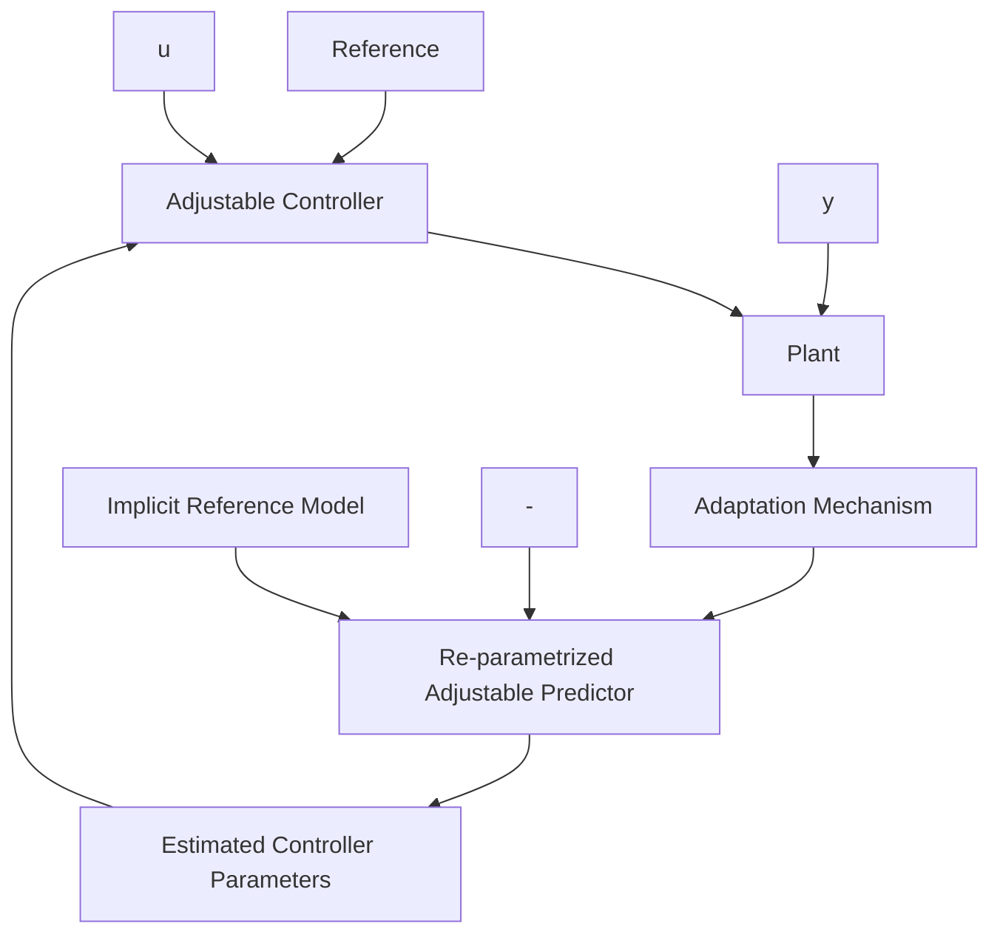

# 1.3.4 Direct and Indirect Adaptive Control: Some Connections

Comparing the direct adaptive control scheme shown in Fig. 1.10 with the indirect adaptive control scheme shown in Fig. 1.13, one observes an important difference. In the scheme of Fig. 1.10, the parameters of the controller are directly estimated (adapted) by the adaptation mechanism. In the scheme of Fig. 1.13, the adaptation mechanism 1 tunes the parameters of an adjustable predictor and these parameters are then used to compute the controller parameters.

However, in a number of cases, related to the desired control objectives and structure of the plant model, by an appropriate parameterization of the adjustable predictor (reparameterization), the parameter adaptation algorithm of Fig. 1.13 will directly estimate the parameter of the controller yielding to a direct adaptive control scheme. In such cases the adaptation mechanism 2 (the design block) disappears and one gets a direct adaptive control scheme. In these schemes, the output of the adjustable predictor (whose parameters are known at each sampling) will behave as the output of a reference model. For this reason, such schemes are also called “implicit model reference adaptive control” (Landau 1981; Landau and Lozano 1981; Egardt 1979). This is illustrated in Fig. 1.14.

To illustrate the idea of “reparameterization” of the plant model, consider the following example. Let the discrete-time plant model be:

$$y (t + 1) = - a _ {1} y (t) + u (t) \tag {1.1}$$

where y is the plant output, u is the plant input and a is an unknown parameter. Assume that the desired objective is to find u(t) such that:

$$y (t + 1) = - c _ {1} y (t) \tag {1.2}$$

flowchart

Fig. 1.14 Implicit model reference adaptive control

(The desired closed-loop pole is defined by $c _ { 1 } )$ . The appropriate control law when $a _ { 1 }$ is known has the form:

$$u (t) = - r _ {0} y (t); \quad r _ {0} = c _ {1} - a _ {1} \tag {1.3}$$

However, (1.1) can be rewritten as:
