The explanation is that identification in closed loop is made with an effective plant input which corresponds to the external excitation filtered by a sensitivity function. This sensitivity function will enhance the signal energy in the frequency range around the band pass of the closed loop and therefore will allow a more accurate model to be obtained in this region, which is critical for the design.

This technique emphasizes the role of identification in closed loop as a basic step for controller tuning based on data obtained in closed-loop operation.

Fig. 1.15 Schematic diagram of the multiple-model adaptive control approach   

```mermaid
graph TD
    A["Controller"] --> B["u"]
    B --> C["G̅"]
    C --> D["ε0"]
    D --> E["ε1"]
    E --> F["ε2"]
    F --> G["εn"]
    G --> H["SUPERVISOR"]
    H --> I["P.A.A."]
    I --> J["εCL"]
    J --> K["ŷ"]
    K --> L["G̅"]
    L --> M["ε3"]
    M --> N["PLANT"]
    N --> O["ε1"]
    O --> P["G1"]
    P --> Q["ε2"]
    Q --> R["ε0"]
    R --> S["Feedback to Controller"]
    T["Controller"] --> U["û"]
    U --> V["G̅"]
    V --> W["ε0"]
    W --> X["ε1"]
    X --> Y["ε2"]
    Y --> Z["εn"]
    Z --> AA["SUPERVISOR"]
    AA --> AB["P.A.A."]
    AB --> AC["εCL"]
    AC --> AD["ε0"]
    AD --> AE["ε1"]
    AE --> AF["ε2"]
    AF --> AG["εn"]
    AG --> AH["SUPERVISOR"]
    AH --> AI["P.A.A."]
    AI --> AJ["εCL"]
    AJ --> AK["ε0"]
    AK --> AL["ε1"]
    AL --> AM["ε2"]
    AM --> AN["εn"]
    AN --> AO["SUPERVISOR"]
    AO --> AP["P.A.A."]
    AP --> AQ["εCL"]
    AQ --> AR["ε0"]
    AR --> AS["ε1"]
    AS --> AT["ε2"]
    AT --> AU["εn"]
    AU --> AV["SUPERVISOR"]
    AV --> AW["P.A.A."]
    AW --> AX["εCL"]
    AX --> AY["ε0"]
    AY --> AZ["ε1"]
    AZ --> BA["ε2"]
    BA --> BB["εn"]
    BB --> BC["SUPERVISOR"]
    BC --> BD["P.A.A."]
```

flowchart

