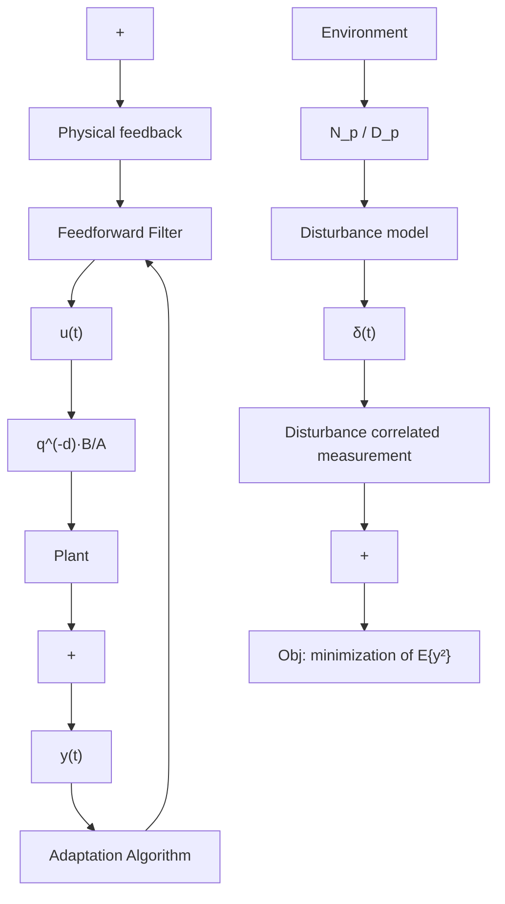

# 1.3.9 Parameter Adaptation Algorithm

The parameter adaptation algorithm (PAA) forms the essence of the adaptation mechanism used to adapt either the parameter of the controller directly (in direct adaptive control), or the parameters of the adjustable predictor of the plant output.

The development of the PAA which will be considered in this book and which is used in the majority of adaptive control schemes assumes that the “models are linear in parameters”,3 i.e., one assumes that the plant model admits a representation of the form:

flowchart

Fig. 1.16 Schematic diagram of the adaptive feedforward disturbance compensation

$$y (t + 1) = \theta^ {T} \phi (t) \tag {1.8}$$

where θ denotes the vector of (unknown) parameters and $\phi ( t )$ is the vector of measurements. This form is also known as a “linear regression”. The objective will be to estimate the unknown parameter vector $\theta$ given in real time y and $\phi$ . Then, the estimated parameter vector denoted $\hat { \theta }$ will be used for controller redesign in indirect adaptive control. Similarly, for direct adaptive control it is assumed that the controller admits a representation of the form:

$$y ^ {*} (t + 1) = - \theta_ {c} ^ {T} \phi (t) \tag {1.9}$$

where $y ^ { * } ( t + 1 )$ is a desired output (or filtered desired output), $\theta _ { c }$ is the vector of the unknown parameters of the controller and $\phi ( t )$ is a vector of measurements and the objective will be to estimate $\theta _ { c }$ given in real time $y ^ { * }$ and $\phi$ .

The parameter adaptation algorithms will be derived with the objective of minimizing a criterion on the error between the plant and the model, or between the desired output and the true output of the closed-loop system.
