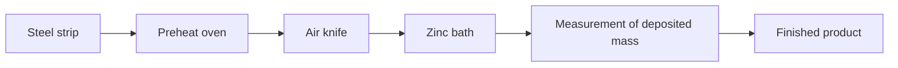

The objective of the control is to assure a good uniformity of the deposited zinc whilst guaranteeing a minimum value of the deposited zinc per unit area. Tight control (i.e., small variance of the controlled variable) will allow a more uniform coating and will reduce the average quantity of deposited zinc per unit area. As a consequence, in addition to quality improvement, a tight control on the deposited zinc per unit area has an important commercial impact since the average consumption for a modern galvanizing line is of the order of 40 tons per day.

flowchart

Fig. 1.17 Hot-dip galvanizing process

The pressure in the air knives, which is the control variable, is itself regulated through a pressure loop, which can be approximated by a first order system. The delay of the process will depend linearly on the speed. Therefore a continuoustime linear dynamic model relating variations of the pressure to variations of the deposited mass, of the form:

$$H (s) = \frac {G e ^ {- s \tau}}{1 + s T}; \quad \tau = \frac {L}{V}$$

can be considered, where L is the distance between the air knives and the transducers and V is the strip speed. When discretizing this model, the major difficulty comes from the variable time-delay. In order to obtain a controller with a fixed number of parameters, the delay of the discrete-time model should remain constant. Therefore, the sampling period $T _ { S }$ is tied to the strip speed using the formula:

$$T _ {s} = \frac {\frac {L}{V} + \delta}{d}; (d = \text { integer })$$

where δ is an additional small time-delay corresponding to the equivalent time-delay of the industrial network and of the programmable controller used for pressure regulation and d is the discrete-time delay (integer). A linearized discrete-time model can be identified.

However, the parameters of the model will depend on the distance between the air knives and the steel strip and on the speed V .

In order to assure satisfactory performances for all regions of operation an “openloop adaptation” technique has been considered. The open-loop adaptation is made with respect to:
