```mermaid
graph TD
    A["Fuel"] --> B["Burner"]
    C["Steam"] --> B
    D["Primary Air"] --> B
    E["Secondary Air"] --> B
    B --> F["Combustion Chamber"]
    F --> G["Rotary Drying Tube"]
    G --> H["Fan"]
    H --> I["Drip Product"]
    I --> J["Dried Product"]
    J --> K["Drip Product Adaptive Temperature Controller"]
    K --> L["Fuel, Steam Primary Air, Controller"]
    L --> M["Drip Product"]
    M --> N["Drip Product"]
    N --> O["Drip Product"]
    O --> P["Drip Product"]
    P --> Q["Drip Product"]
    Q --> R["Drip Product"]
    R --> S["Drip Product"]
    S --> T["Drip Product"]
    T --> U["Drip Product"]
    U --> V["Drip Product"]
    V --> W["Drip Product"]
    W --> X["Drip Product"]
    X --> Y["Drip Product"]
    Y --> Z["Drip Product"]
    Z --> AA["Drip Product"]
    AA --> AB["Drip Product"]
    AB --> AC["Drip Product"]
    AC --> AD["Drip Product"]
    AD --> AE["Drip Product"]
    AE --> AF["Drip Product"]
    AF --> AG["Drip Product"]
    AG --> AH["Drip Product"]
    AH --> AI["Drip Product"]
    AI --> AJ["Drip Product"]
    AJ --> AK["Drip Product"]
    AK --> AL["Drip Product"]
    AL --> AM["Drip Product"]
    AM --> AN["Drip Product"]
    AN --> AO["Drip Product"]
    AO --> AP["Drip Product"]
    AP --> AQ["Drip Product"]
    AQ --> AR["Drip Product"]
    AR --> AS["Drip Product"]
    AS --> AT["Drip Product"]
    AT --> AU["Drip Product"]
    AU --> AV["Drip Product"]
    AV --> AW["Drip Product"]
    AW --> AX["Drip Product"]
    AX --> AY["Drip Product"]
    AY --> AZ["Drip Product"]
    AZ --> BA["Drip Product"]
    BA --> BB["Drip Product"]
    BB --> BC["Drip Product"]
    BC --> BD["Drip Product"]
    BD --> BE["Drip Product"]
    BE --> BF["Drip Product"]
    BF --> BG["Drip Product"]
    BG --> BH["Drip Product"]
    BH --> BI["Drip Product"]
    BI --> BJ["Drip Product"]
    BJ --> BK["Drip Product"]
    BK --> BL["Drip Product"]
    BL --> BM["Drip Product"]
    BM --> BN["Drip Product"]
    BN --> BO["Drip Product"]
    BO --> BP["Drip Product"]
    BP --> BQ["Drip Product"]
    BQ --> BR["Drip Product"]
    BR --> BS["Drip Product"]
    BS --> BT["Drip Product"]
    BT --> BU["Drip Product"]
    BU --> BV["Drip Product"]
    BV --> BW["Drip Product"]
    BW --> BX["Drip Product"]
    BX --> BYD["Drip Product"]
    BYD --> BZ["Drip Product"]
    BZ --> CA["Drip Product"]
    CA --> CB["Drip Product"]
    CB --> CC["Drip Product"]
    CC --> CD["Drip Product"]
    CD --> CE["Drip Product"]
    CE --> CF["Drip Product"]
    CF --> CG["Drip Product"]
    CG --> CH["Drip Product"]
    CH --> CI["Drip Product"]
    CI --> CJ["Drip Product"]
    CJ --> CK["Drip Product"]
```

Fig. 1.18 Phosphate drying furnace

Significant improvement in performance was obtained with respect to a standard PID controller (the system has a delay of about 90 s). The improved regulation has as a side effect an average reduction of the fuel consumption and a reduction of the thermal stress on the combustion chamber walls allowing to increase the average time between two maintenance operations.
