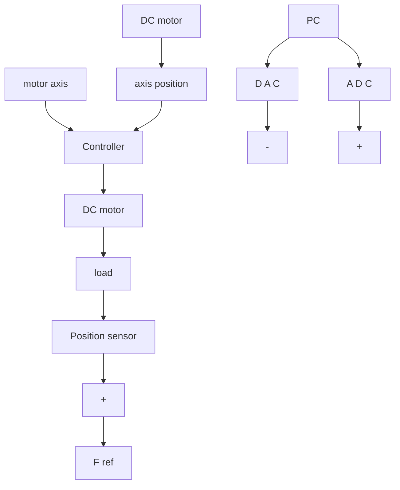

# 1.4.3 Indirect and Multimodel Adaptive Control of a Flexible Transmission

The flexible transmission built at GIPSA-LAB, Control Dept. (CNRS-INPG-UJF), Grenoble, France, consists of three horizontal pulleys connected by two elastic belts (Fig. 1.19). The first pulley is driven by a D.C. motor whose position is controlled by local feedback. The third pulley may be loaded with disks of different weight. The objective is to control the position of the third pulley measured by a position sensor. The system input is the reference for the axis position of the first pulley. A PC is used to control the system. The sampling frequency is 20 Hz.

The system is characterized by two low-damped vibration modes subject to a large variation in the presence of load. Fig. 1.20 gives the frequency characteristics of the identified discrete-time models for the case without load, half load (1.8 kg) and full load (3.6 kg). A variation of 100% of the first vibration mode occurs when passing from the full loaded case to the case without load. In addition, the system features a delay and unstable zeros. The system was used as a benchmark for robust digital control (Landau et al. 1995a), as well as a test bed for indirect adaptive control, multiple model adaptive control, identification in open-loop and closed-loop operation, iterative identification in closed loop and control redesign. The use of various algorithms for real-time identification and adaptive control which will be discussed throughout the book will be illustrated on this real system (see Chaps. 5, 9, 12, 13 and 16).

Fig. 1.19 The flexible transmission (GIPSA-LAB, Grenoble), (a) block diagram, (b) view of the system   

flowchart

natural_image

Laboratory setup with metal scales and control panels against a blue background (no visible text or symbols)

