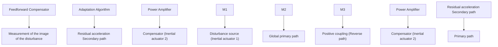

Fig. 1.24 An active vibration control using feedforward compensation (scheme)

gives an image of the disturbance to be used for feedforward compensation. As it results clearly from Figs. 1.23 and 1.24, the actuator located down side will compensate vibrations at the level of the lowest plate but will induce forces upstream beyond this plate an therefore a positive feedback is present in the system which modifies the effective measurement of the image of the disturbance. The algorithms which will be presented in Chap. 15 will be evaluated on this system.
