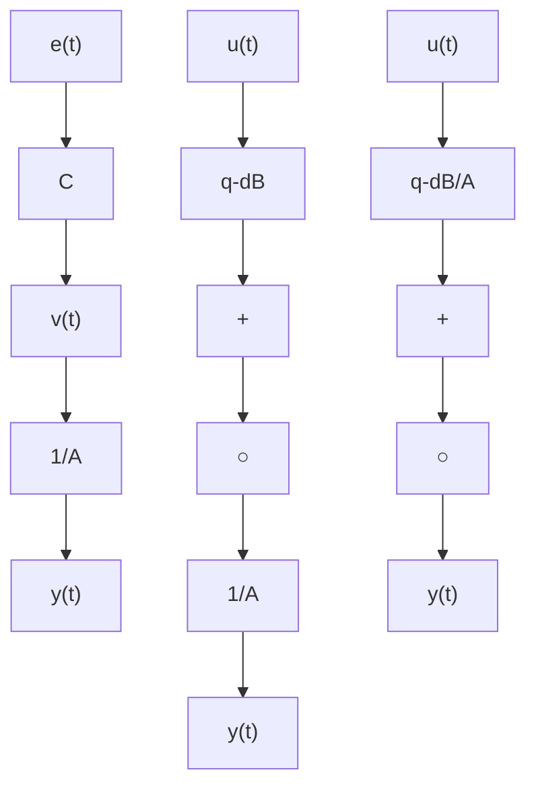

# 2.2.1 Input-Output Models

In many practical situations, the deterministic input-output model given in (2.1) cannot take into account the presence of stochastic disturbances. A model is therefore needed which accommodates the presence of such disturbances.

An immediate extension of the deterministic input-output model is:

$$y (t + 1) = - A ^ {*} (q ^ {- 1}) y (t) + q ^ {- d} B ^ {*} (q ^ {- 1}) u (t) + v (t + 1) \tag {2.52}$$

where v(t) is a stochastic process which describes the effect upon the output of the various stochastic disturbances. However, we need to further characterize this disturbance in order to predict the behavior of the system, and to control it.

Stationary stochastic disturbances having a rational spectrum can be modeled as the output of a dynamic system driven by a Gaussian white noise sequence (Factorization Theorem—Åström 1970; Faurre et al. 1979; Åström et al. 1984).

The Gaussian discrete-time white noise is a sequence of independent, equally distributed (Gaussian) random variables of zero mean value and variance $\sigma ^ { 2 }$ . This sequence will be denoted $\{ e ( t ) \}$ and characterized by $( 0 , \sigma )$ , where the first number indicates the mean value and second number indicates the standard deviation.

Fig. 2.1 Configuration for additive stochastic disturbances, (a) equation error model structure, (b) output error model structure   

flowchart

A large class of stochastic processes of interest for applications will be described by the output of a poles and zeros system driven by white noise called the Auto Regressive Moving Average (ARMA) process.

$$v (t) = \frac {C (q ^ {- 1})}{D (q ^ {- 1})} e (t) \tag {2.53}$$

where:

$$C (q ^ {- 1}) = 1 + c _ {1} q ^ {- 1} + \dots + c _ {n _ {C}} q ^ {- n _ {C}} \tag {2.54}D (q ^ {- 1}) = 1 + d _ {1} q ^ {- 1} + \dots + d _ {n _ {D}} q ^ {- n _ {D}} \tag {2.55}$$

$D ( z ^ { - 1 } )$ has all its roots inside the unit circle and it will be assumed that $C ( z ^ { - 1 } )$ also has all its roots inside the unit circle.3
