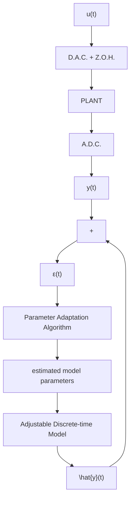

Fig. 3.1 Parameter estimation principle   

flowchart

In general a parameter vector is defined. Its components are the different parameters that should be estimated.

Parameter adaptation algorithms generally have the following structure:

$$
\begin{array}{l} \left[ \begin{array}{c} \text { New   estimated } \\ \text { parameters } \\ (\text { vector }) \end{array} \right] = \left[ \begin{array}{c} \text { Previous   estimated } \\ \text { parameters } \\ (\text { vector }) \end{array} \right] + \left[ \begin{array}{c} \text { Adaptation } \\ \text { gain } \\ (\text { matrix }) \end{array} \right] \\ \times \left[ \begin{array}{c} \text {Measurement} \\ \text {function} \\ (\text {vector}) \end{array} \right] \times \left[ \begin{array}{c} \text {Prediction error} \\ \text {function} \\ (\text {scalar}) \end{array} \right] \\ \end{array}
$$

This structure corresponds to the so-called integral type adaptation algorithms (the algorithm has memory and therefore maintains the estimated value of the parameters when the correcting terms become null). The algorithm can be viewed as a discretetime integrator fed at each instant by the correcting term. The measurement function vector is generally called the observation vector. The prediction error function is generally called the adaptation error.

As will be shown, there are more general structures where the integrator is replaced by other types of dynamics, i.e., the new value of the estimated parameters will be equal to a function of the previous parameter estimates (eventually over a certain horizon) plus the correcting term.

The adaptation gain plays an important role in the performances of the parameter adaptation algorithm and it may be constant or time-varying.

The problem addressed in this chapter is the synthesis and analysis of parameter adaptation algorithms in a deterministic environment.
