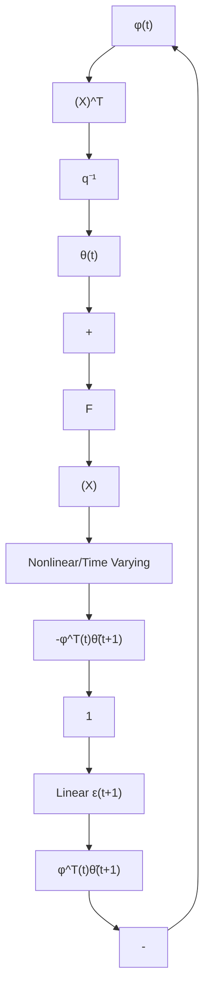
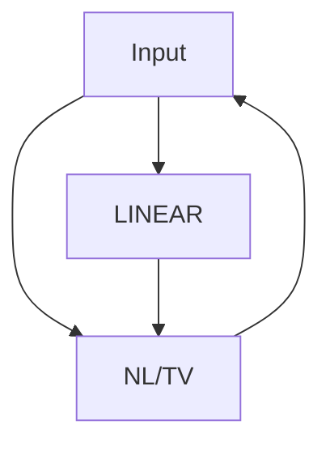

# 3.3.1 Equivalent Feedback Representation of the Parameter Adaptation Algorithms and the Stability Problem

In the case of recursive least squares or of the improved gradient algorithm, the following a posteriori predictor has been used:

$$\hat {y} (t + 1) = \hat {\theta} ^ {T} (t + 1) \phi (t) \tag {3.110}$$

where

$$
\begin{array}{l} \hat {\theta} ^ {T} (t) = [ - \hat {a} _ {1} (t), \dots , - \hat {a} _ {n _ {A}} (t), \hat {b} _ {1} (t), \dots , \hat {b} _ {n _ {B}} (t) ] \\ \phi^ {T} (t) = [ - y (t), \dots , - y (t - n _ {A} + 1), u (t - d), \dots , u (t - d - n _ {B} + 1) ] \\ \end{array}
$$

The PAA has the following form:

$$\hat {\theta} (t + 1) = \hat {\theta} (t) + F (t) \phi (t) \varepsilon (t + 1) \tag {3.111}$$

flowchart

flowchart

Fig. 3.5 Equivalent feedback representation of PAA, (a) the case of RLS, (b) generic equivalent representation

The parameter error is defined as:

$$\tilde {\theta} (t) = \hat {\theta} (t) - \theta \tag {3.112}$$

Subtracting θ in both sides of (3.111) and, taking into account (3.112), one obtains:

$$\tilde {\theta} (t + 1) = \tilde {\theta} (t) + F (t) \phi (t) \varepsilon (t + 1) \tag {3.113}$$

From the definition of the a posteriori prediction error ε(t + 1) given by (3.8) and taking into account (3.60) and (3.112), one gets:

$$\varepsilon (t + 1) = y (t + 1) - \hat {y} (t + 1) = \phi^ {T} (t) \theta - \phi^ {T} (t) \hat {\theta} (t + 1) = - \phi^ {T} (t) \tilde {\theta} (t + 1) \tag {3.114}$$

and using (3.113), one can write:

$$\phi (t) \tilde {\theta} (t + 1) = \phi^ {T} (t) \tilde {\theta} (t) + \phi^ {T} (t) F (t) \phi (t) \varepsilon (t + 1) \tag {3.115}$$
