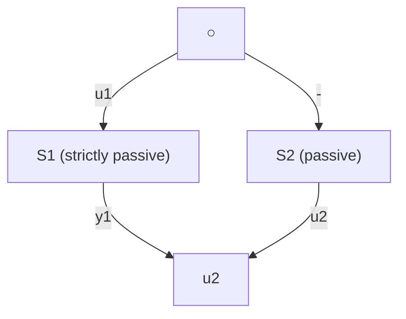

Passivity (hyperstability) properties or Lyapunov functions with two (or several) terms are well suited for the stability analysis of feedback systems. The passivity (hyperstability) approach is more natural and systematic, but the same results can be obtained by using Lyapunov functions of particular form (for a discussion of the relationship between these two approaches see Brogliato et al. 1993).

The passivity approach concerns input-output properties of systems and the implications of these properties for the case of feedback interconnection.

We shall next present a pragmatic approach without formal generalized and proven results concerning the use of the passivity approach for the analysis and the synthesis of PAA. Detailed results can be found in Sects. 3.3.3 and 3.3.4 and the Appendix C.

The norm $L _ { 2 }$ is defined as:

$$\| x (t) \| _ {2} = \left(\sum_ {0} ^ {\infty} x ^ {2} (t)\right) ^ {1 / 2}$$

(it is assumed that all signals are 0 for $t < 0 )$ .

To avoid the assumption that all signals go to zero as $t \to \infty$ , one uses the socalled extended $L _ { 2 }$ space denoted $L _ { 2 } e$ which contains the truncated sequences:

$$
x _ {T} (t) = \left\{ \begin{array}{l l} x (t) & 0 \leq t \leq T \\ 0 & t > T \end{array} \right.
$$

Fig. 3.6 Feedback interconnection of two passive blocks   

flowchart

Consider a SISO system S with input u and output y. Let us define the inputoutput product:

$$\eta (0, t _ {1}) = \sum_ {t = 0} ^ {t _ {1}} u (t) y (t)$$

A system S is termed passive if:

$$\eta (0, t _ {1}) \geq - \gamma^ {2}; \quad \gamma^ {2} < \infty ; \forall t _ {1} \geq 0$$

A system S is termed (input) strictly passive if:

$$\eta (0, t _ {1}) \geq - \gamma^ {2} + \kappa \| u \| _ {2} ^ {2}; \quad \gamma^ {2} < \infty ; \kappa > 0; \forall t _ {1} \geq 0$$

and (output) strictly passive if:

$$\eta (0, t _ {1}) \geq - \gamma^ {2} + \delta \| y \| _ {2} ^ {2}; \quad \gamma^ {2} < \infty ; \delta > 0; \forall t _ {1} \geq 0$$

Consider now the feedback interconnection between a block S which is strictly passive (for example strictly input passive) and a block S which is passive as illustrated in Fig. 3.6.

One has:
