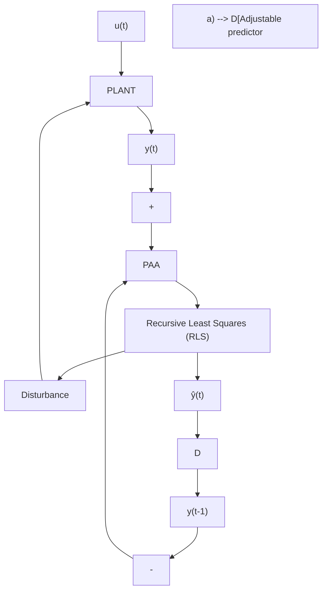
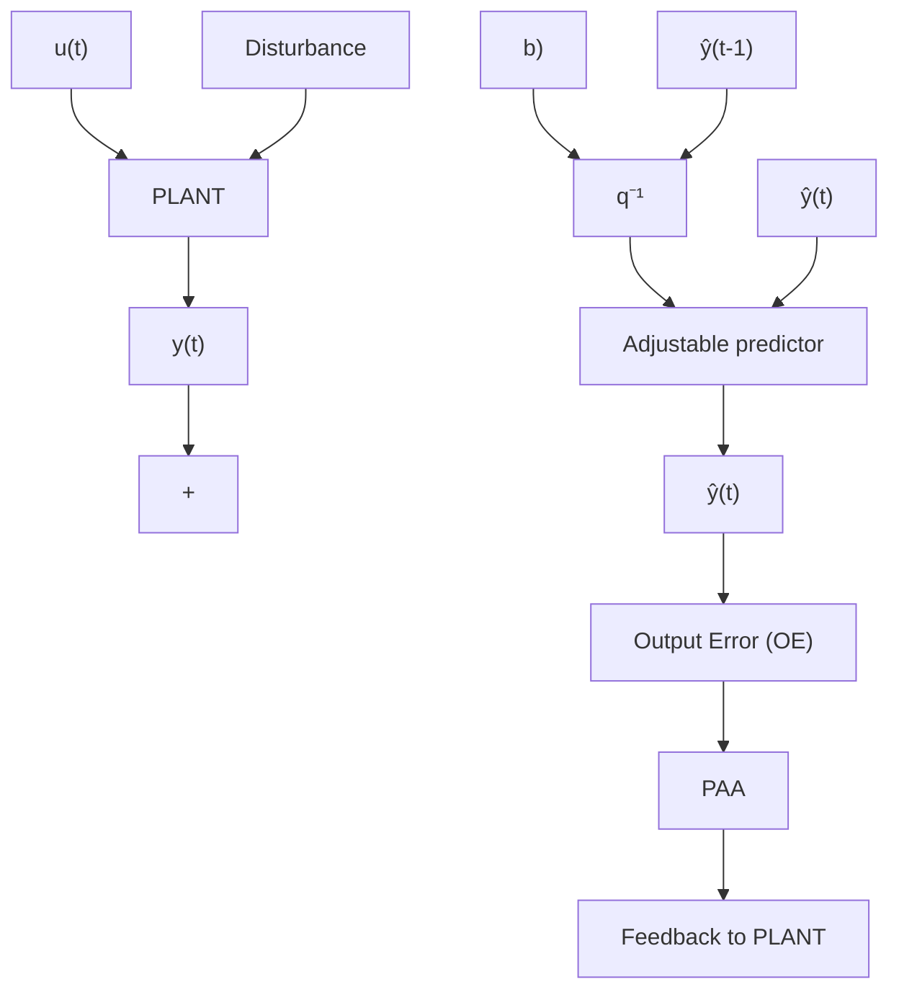

The objective is now to write an equation for the a posteriori prediction error as a function of the parameter error. Observe first that by adding and subtracting the term $\pm a _ { 1 } \hat { y } ( t )$ to (3.126), the output of the plant can be expressed as:

$$y (t + 1) = - a _ {1} \hat {y} (t) + b _ {1} u (t) - a _ {1} \varepsilon (t) = - a _ {1} \varepsilon (t) + \theta^ {T} \phi (t) \tag {3.133}$$

Taking into account (3.129) and (3.133), (3.132) becomes:

$$
\begin{array}{l} \varepsilon (t + 1) = - a _ {1} \varepsilon (t) + \phi^ {T} (t) [ \theta - \hat {\theta} (t + 1) ] \\ = - a _ {1} \varepsilon (t) - \phi^ {T} (t) \tilde {\theta} (t + 1) \tag {3.134} \\ \end{array}
$$

flowchart

flowchart

Fig. 3.7 Comparison between two adjustable predictor structures, (a) recursive least squares (equation error), (b) output error

which can be rewritten as:

$$A (q ^ {- 1}) \varepsilon (t + 1) = - \phi^ {T} (t) \tilde {\theta} (t + 1) \tag {3.135}$$

where:

$$A (q ^ {- 1}) = 1 + a _ {1} q ^ {- 1} = 1 + q ^ {- 1} A ^ {*} (q ^ {- 1}) \tag {3.136}$$

from which one obtains:

$$\varepsilon (t + 1) = \frac {1}{A (q ^ {- 1})} [ - \phi^ {T} (t) \tilde {\theta} (t + 1) ] \tag {3.137}$$

This result remains valid even for higher order predictors where $a _ { 1 }$ is replaced by $A ^ { * } ( q - 1 ) = a _ { 1 } + a _ { 2 } q ^ { - 1 } + \cdot \cdot \cdot + a _ { n _ { A } } q ^ { - n _ { A } }$ . In other words, the a posteriori prediction error is the output of a linear block characterized by a transfer function $1 / A ( z ^ { - 1 } )$ ), whose input is $\overline { { - \phi ^ { T } ( t ) \tilde { \theta } ( t + 1 ) } }$ .

Once the equation for the a posteriori prediction error has been derived, the PAA synthesis problem can be formulated as:
