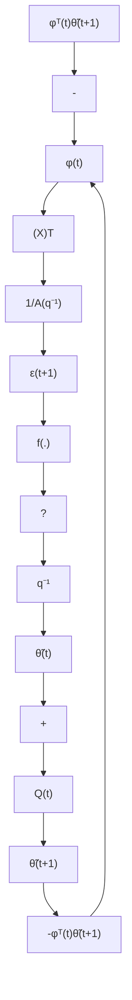

flowchart

Fig. 3.8 Equivalent feedback system associated to the output error predictor

Find a PAA of the form:

$$\hat {\theta} (t + 1) = \hat {\theta} (t) + f _ {\theta} [ \phi (t), \hat {\theta} (t), \varepsilon (t + 1) ] \tag {3.138}\varepsilon (t + 1) = f _ {\varepsilon} [ \phi (t), \hat {\theta} (t), \varepsilon^ {0} (t + 1) ] \tag {3.139}$$

such that li $\begin{array} { r } { \mathbf { m } _ { t  \infty } \varepsilon ( t + 1 ) = 0 , } \end{array}$ for all initial conditions $\varepsilon ( 0 ) , \hat { \theta } ( 0 ) ( o r \tilde { \theta } ( 0 ) )$ .

Note that the structure of (3.138) assures the memory of the PAA (integral form), but other structures can be considered. The structure of (3.139) assures the causality of the algorithm.

From (3.138) subtracting θ from both sides, one gets:

$$\tilde {\theta} (t + 1) = \tilde {\theta} (t) + f _ {\theta} [ \phi (t), \hat {\theta} (t), \varepsilon (t + 1) ] \tag {3.140}$$

and multiplying both sides by $\phi ^ { T } ( t )$ , yields:

$$\phi^ {T} (t) \tilde {\theta} (t + 1) = \phi^ {T} (t) \tilde {\theta} (t) + \phi^ {T} (t) f _ {\theta} [ \phi (t), \hat {\theta} (t), \varepsilon (t + 1) ] \tag {3.141}$$

Equations (3.137), (3.140) and (3.141) define an equivalent feedback system associated to the output error predictor as shown in Fig. 3.8.

Based on the passivity approach, our objective will be to first find $f _ { \theta } ( . )$ such that the equivalent feedback path be passive and then we will see under what conditions the feedforward path is strictly passive.

The passivity of the equivalent feedback path requires that:

$$\sum_ {t = 0} ^ {t _ {1}} \tilde {\theta} ^ {T} (t + 1) \phi (t) \varepsilon (t + 1) \geq - \gamma_ {2} ^ {2}; \quad \gamma_ {2} ^ {2} < \infty ; \forall t _ {1} \geq 0 \tag {3.142}$$

On the other hand, from (3.118) through (3.121), one has the following basic results:

$$\sum_ {t = 0} ^ {t _ {1}} \tilde {\theta} ^ {T} (t + 1) F ^ {- 1} [ \tilde {\theta} (t + 1) - \tilde {\theta} (t) ] \geq - \frac {1}{2} \tilde {\theta} ^ {T} (0) F ^ {- 1} \tilde {\theta} (0); \quad F > 0; \forall t _ {1} \geq 0 \tag {3.143}$$
