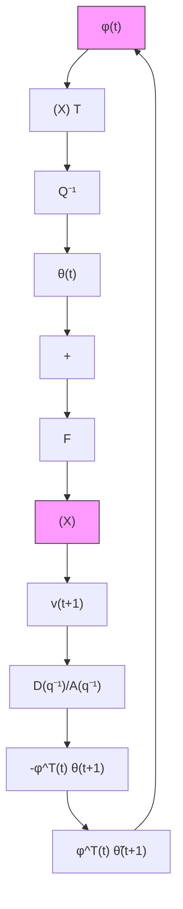

$$\bar {U} (z ^ {- 1}) = \sum_ {t = 0} ^ {\infty} \bar {u} _ {1} (t) z ^ {- t} \tag {3.153}$$

always exists and:

$$\eta_ {1} (0, t _ {1}) = \sum_ {t = 0} ^ {t _ {1}} u _ {1} (t) y _ {1} (t) = \sum_ {t = 0} ^ {\infty} \bar {u} _ {1} (t) \bar {y} _ {1} (t) \tag {3.154}$$

But since $\bar { y } _ { 1 } ( t )$ is the output of a linear system characterized by a transfer function $H ( z ^ { - 1 } )$ , one has:

$$y _ {1} (t) = \frac {1}{2 \pi} \int_ {- \pi} ^ {\pi} H (e ^ {j \omega}) \bar {U} (e ^ {j \omega}) e ^ {j t \omega} d \omega \tag {3.155}$$

This integral exists under the assumption that $H ( z ^ { - 1 } )$ is asymptotically stable $( \mathrm { i . e . }$ , all its poles lie in $| z | < 1 )$ .

Introducing (3.155) in (3.154) one obtains:

$$\eta_ {1} (0, t _ {1}) = \frac {1}{2 \pi} \sum_ {t = 0} ^ {\infty} \int_ {- \pi} ^ {\pi} u (t) e ^ {j t \omega} H (e ^ {j \omega}) \bar {U} (e ^ {j \omega}) d \omega \tag {3.156}$$

Interchanging the sum and the integral in (3.156), one obtains:

$$
\begin{array}{l} \eta_ {1} (0, t _ {1}) = \frac {1}{2 \pi} \int_ {- \pi} ^ {\pi} \left(\sum_ {t = 0} ^ {\infty} \bar {u} _ {1} (t) e ^ {j t \omega}\right) H (e ^ {j \omega}) \bar {U} (e ^ {j \omega}) d \omega \\ = \frac {1}{2 \pi} \int_ {- \pi} ^ {\pi} \bar {U} (e ^ {- j \omega}) H (e ^ {j \omega}) \bar {U} (e ^ {j \omega}) d \omega \\ = \frac {1}{4 \pi} \int_ {- \pi} ^ {\pi} \bar {U} (e ^ {- j \omega}) [ H (e ^ {j \omega}) + H (e ^ {- j \omega}) ] \bar {U} (e ^ {j \omega}) d \omega \tag {3.157} \\ \end{array}
$$

In order to satisfy the strict passivity condition it is necessary and sufficient that:

$$\frac {1}{2} [ H (e ^ {j \omega}) + H (e ^ {- j \omega}) ] = \mathrm{Re} H (e ^ {j \omega}) > \delta > 0; \quad \forall - \pi < \omega < \pi \tag {3.158}$$

which implies that $H ( z ^ { - 1 } )$ should be a strictly positive real transfer function formally characterized by:

• $H ( z ^ { - 1 } )$ is real for real z,   
• All the poles of $H ( z ^ { - 1 } )$ lie in $\mid z \mid < 1$ ,   
• $H ( z ^ { - 1 } ) > 0$ for all $\mid z \mid = 1$

flowchart

Fig. 3.9 Equivalent feedback representation for the output error with fixed compensator
