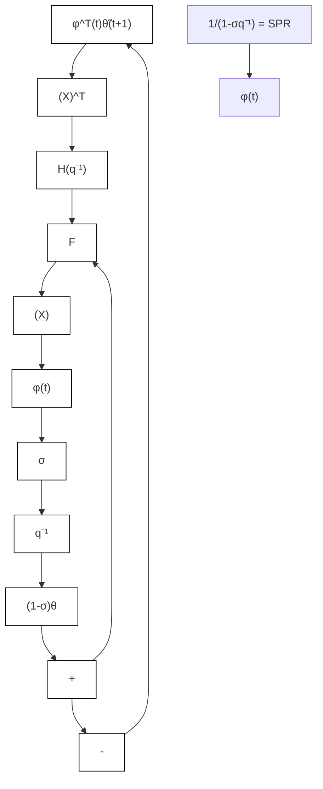

$$D (N) = \{[ \theta - \hat {\theta} (t) ] ^ {T} [ \theta - \hat {\theta} (t) ] \} ^ {1 / 2}$$

for the case of integral + proportional adaptation.

line

| N | Fp=-0.2I | Fp=0 | Fp=0.5I | Fp=2I |
| --- | --- | --- | --- | --- |
| 0 | 0.0 | 0.0 | 0.0 | 0.0 |
| 5 | 0.08 | 0.06 | 0.03 | 0.01 |
| 10 | 0.09 | 0.06 | 0.03 | 0.01 |
| 15 | 0.09 | 0.06 | 0.03 | 0.01 |
| 20 | 0.09 | 0.06 | 0.03 | 0.01 |
| 25 | 0.09 | 0.06 | 0.03 | 0.01 |
| 30 | 0.09 | 0.06 | 0.03 | 0.01 |
| 35 | 0.09 | 0.06 | 0.03 | 0.01 |
| 40 | 0.09 | 0.06 | 0.03 | 0.01 |
| 45 | 0.09 | 0.06 | 0.03 | 0.01 |

line

| N | Fp=0 | Fp=0.5I | Fp=2I | Fp=-0.2I |
| --- | --- | --- | --- | --- |
| 0 | 1.8 | 1.8 | 1.8 | 1.8 |
| 5 | 1.3 | 1.3 | 1.3 | 1.3 |
| 10 | 0.9 | 0.9 | 0.9 | 0.9 |
| 15 | 0.6 | 0.6 | 0.6 | 0.6 |
| 20 | 0.4 | 0.4 | 0.4 | 0.4 |
| 25 | 0.3 | 0.3 | 0.3 | 0.3 |
| 30 | 0.2 | 0.2 | 0.2 | 0.2 |
| 35 | 0.2 | 0.2 | 0.2 | 0.2 |
| 40 | 0.2 | 0.2 | 0.2 | 0.2 |
| 45 | 0.2 | 0.2 | 0.2 | 0.2 |

Fig. 3.10 (a) Evolution of $\begin{array} { r } { J ( N ) = \sum _ { 0 } ^ { N } \nu ^ { 2 } ( t + 1 ) } \end{array}$ , (b) evolution of the parametric distance $D ( N ) = \{ [ \theta - { \hat { \theta } } ( t ) ] ^ { T } [ \theta - { \hat { \theta } } ( t ) ] \} ^ { 1 / 2 }$

The nominal system is:

$$G (q ^ {- 1}) = \frac {q ^ {- 1} (q ^ {- 1} + 0 . 5 q ^ {- 2})}{1 - 1 . 5 q ^ {- 1} + 0 . 7 q ^ {- 2}}$$

Fig. 3.11 Equivalent feedback representation for the output error with leakage   

flowchart

