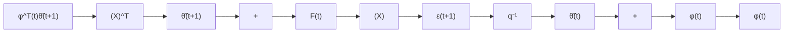
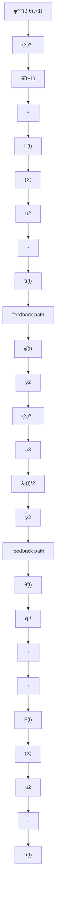

But $\begin{array} { r } { ( 1 - \frac { \lambda _ { 2 } ( t ) } { 2 } ) > 0 } \end{array}$ since $\lambda _ { 2 } ( t ) < 2$ and one concludes from (3.229) that $\varepsilon ( t + 1 )$ is bounded and:4

$$\lim _ {t \to \infty} \varepsilon (t + 1) = 0 \tag {3.230}$$

There are two possible interpretations of this result:

flowchart

flowchart

Fig. 3.12 The feedback composite block, (a) original equivalent feedback block (RLS), (b) feedback composite block
