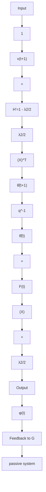

# • Second interpretation

Let us consider a composite block obtained from the equivalent feedback path by adding a negative feedback through a time-varying gain $\frac { \lambda _ { 2 } ( t ) } { 2 }$ as shown in Fig. 3.12.

The resulting input and output relationships are:

$$u _ {2} = \bar {u} - y _ {3}\bar {y} = y _ {2} = u _ {3}$$

Therefore the input-output product of the composite block is expressed as:

$$
\begin{array}{l} \sum \bar {u} (t) \bar {y} (t) = \sum y (t) [ u _ {2} + y _ {3} ] = \sum y _ {2} (t) u _ {2} (t) + \sum u _ {3} (t) y _ {3} (t) \\ = \sum y _ {2} (t) u _ {2} (t) + \sum \frac {\lambda_ {2} (t)}{2} (\tilde {\theta} ^ {T} (t + 1) \phi (t)) ^ {2} \\ \geq - \frac {1}{2} \tilde {\theta} (0) F (0) ^ {- 1} \tilde {\theta} (0) \\ \end{array}
$$

Fig. 3.13 Transformed equivalent feedback system representation for the case of recursive least squares with λ2 = const   

flowchart

The consequence of this relationship is that the equivalent feedback block in the case of a decreasing adaptation gain in feedback connection with a block having the gain $\frac { \lambda _ { 2 } ( t ) } { 2 }$ is passive.

Let us consider next the case $\lambda _ { 2 } ( t ) \equiv \lambda _ { 2 } = \mathrm { c o n s t } .$ . In order that the equivalent feedback system remains unchanged, it will be necessary to add a block with a gain $\frac { \lambda _ { 2 } } { 2 }$ in parallel to the feedforward block, as indicated in the transformed EFR shown in Fig. 3.13. The strict passivity condition on the transformed equivalent feedforward path becomes:

$$1 - \frac {\lambda_ {2}}{2} > 0$$

This obviously generalizes for the cases where the equivalent feedforward path is a transfer function, leading to the condition:

$$H ^ {\prime} (z ^ {- 1}) = H (z ^ {- 1}) - \frac {\lambda_ {2}}{2}$$

be strictly positive real.

The case $\lambda _ { 2 } ( t )$ requires us to consider a feedback around the equivalent feedback path with a gain $\frac { \lambda _ { 2 } } { 2 }$ where $\lambda _ { 2 } \geq \operatorname* { m a x } _ { t } \lambda _ { 2 } ( t )$ . Both types of argument can be used for dealing with the general case of a time-varying adaptation gain given by (3.222).
