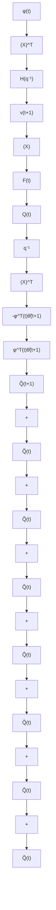
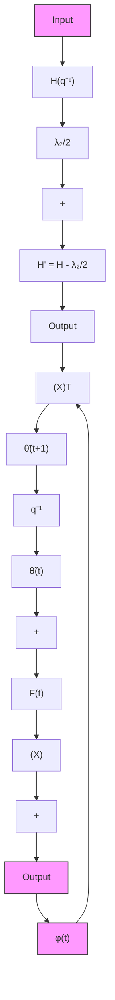

flowchart

flowchart

Fig. 3.14 Transformed equivalent feedback systems associated to the PAA with time-varying gain

Adding and subtracting the term $\hat { \theta } ^ { T } ( t ) \phi ( t )$ in the right hand side of (3.239), one gets:

$$
\begin{array}{l} \nu (t + 1) = [ \hat {\theta} (t) - \hat {\theta} (t + 1) ] ^ {T} \phi (t) \\ + \{[ \theta - \hat {\theta} (t) ] ^ {T} \phi (t) + H _ {1} ^ {*} (q ^ {- 1}) [ \theta - \hat {\theta} (t) ] ^ {T} \phi (t - 1) \\ \left. - H _ {2} ^ {*} \left(q ^ {- 1}\right) v (t) \right\} \tag {3.240} \\ \end{array}
$$

Comparing (3.238) and (3.240), one observes that:

$$
\begin{array}{l} \nu^ {0} (t + 1) = [ \theta - \hat {\theta} (t) ] ^ {T} \phi (t) - H _ {1} ^ {*} (q ^ {- 1}) [ \theta - \hat {\theta} (t) ] ^ {T} \phi (t - 1) \\ - H _ {2} ^ {*} (q ^ {- 1}) \nu (t) \tag {3.241} \\ \end{array}
$$

and one clearly sees that $\nu ^ { 0 } ( t + 1 )$ depends upon $\hat { \theta } ( i )$ for $i \le t$

The PAA of (3.231) through (3.233), together with (3.235), define an equivalent feedback system with a linear time-invariant feedforward block and a time-varying and/or nonlinear feedback block (see Fig. 3.14a).

Exploiting the input-output properties of the equivalent feedback and feedforward block, one has the following general result.
