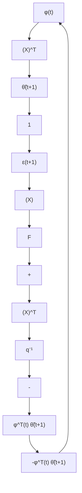
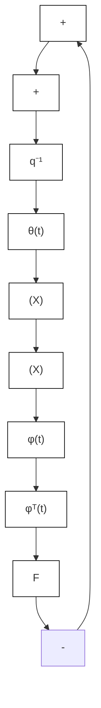

flowchart

flowchart

Fig. 3.15 Equivalent feedback representation of the improved gradient PAA, (a) standard configuration, (b) equivalent transformation

in which $\hat { y } ( t + 1 )$ is the output predicted by the estimation model with the constant parameters $\hat { a } _ { 1 } , \hat { b } _ { 1 }$ .

Now assume that $u ( t ) = \mathrm { c o n s t a n t }$ and that the parameters $a _ { 1 } , b _ { 1 } , \hat { a } _ { 1 } , \hat { b } _ { 1 }$ verify the following relation:

$$\frac {b _ {1}}{1 + a _ {1}} = \frac {\hat {b} _ {1}}{1 + \hat {a} _ {1}} \tag {3.299}$$

i.e., the steady state gains of the system and of the estimated model are equal even if $\hat { b } _ { 1 } \neq b _ { 1 }$ and $\hat { a } _ { 1 } \neq a _ { 1 }$ . Under the effect of the constant input $u ( t ) = u$ , the plant output will be given by:

$$y (t + 1) = y (t) = \frac {b _ {1}}{1 + a _ {1}} u \tag {3.300}$$

and the output of the estimated prediction model will be given by:

$$\hat {y} (t + 1) = \hat {y} (t) = \frac {\hat {b} _ {1}}{1 + \hat {a} _ {1}} u \tag {3.301}$$

However taking into account (3.299), it results that:

$$\varepsilon (t + 1) = y (t + 1) - \hat {y} (t + 1) = 0\text { for } u (t) = \text { const }; \hat {a} _ {1} \neq a _ {1}; \hat {b} _ {1} \neq b _ {1} \tag {3.302}$$

Fig. 3.16 Gain frequency characteristics of two systems with the same steady state gain   

text_image

G
plant
model
ω

