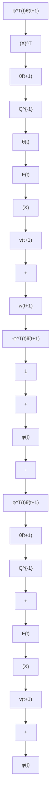

where $p ( t )$ should go to ∞ as $t \to \infty$ . In particular, the stochastic approximation algorithm which uses:

$$F (t) = \frac {1}{t} \tag {4.12}$$

satisfies this property.1

The equivalent feedback system associated to (4.6) and (4.7) is shown in Fig. 4.1a. Figure 4.1b gives the equivalent feedback in the general case when the a posteriori adaptation error equation takes the form:

$$\nu (t + 1) = H (q ^ {- 1}) (\theta - \hat {\theta} (t + 1)) ^ {T} \phi (t) + w (t + 1) \tag {4.13}$$

where $w ( t + 1 )$ is the image of the disturbance in the adaptation error equation.

Therefore, one gets a feedback system with an external input. Several major questions require an answer:

1. Is $\hat { \theta } ( t ) = \theta$ a possible equilibrium point of the system?   
2. If this is not the case, what are the possible equilibrium points?   
3. Does the algorithm converge to the equilibrium points for any initial conditions?

The answer to these questions will depend upon the nature of the disturbance, as well as upon the structure of the adjustable predictor, the way in which the adaptation error is generated and the choice of the observation vector.

If the estimated parameters do not converge to the values corresponding to the deterministic case (under same input richness conditions), the resulting estimates will be called biased estimates, and the corresponding error will be termed bias (or more exactly asymptotic bias).

Looking to Fig. 4.1, one can ask under what conditions (using a decreasing adaptation gain) $\hat { \theta } = \theta$ is a possible equilibrium point. Alternatively, this can be formulated as follows: under what conditions the input into the integrator in the feedback path (which generates $\tilde { \theta } ( t ) )$ will be null in the average. A first answer is given by the condition:

flowchart

